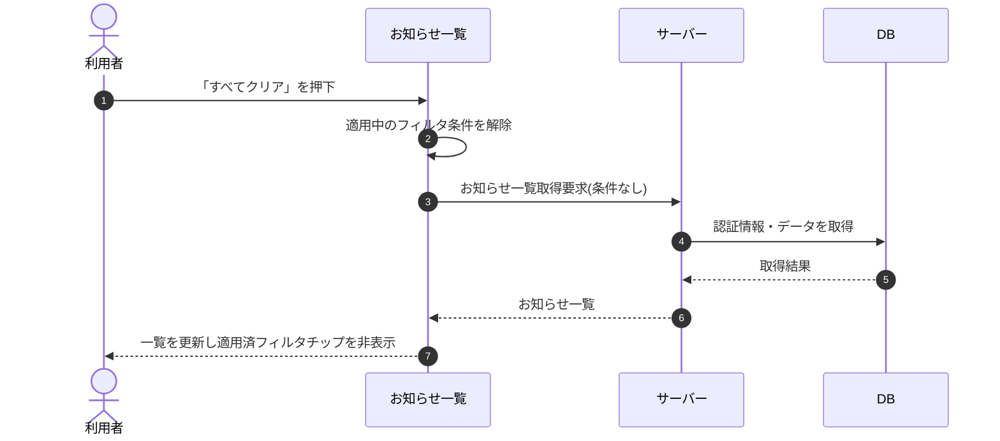

# SEQ-055: 「すべてクリア」を押下

> **このページは、業務ユースケース UC-043（「すべてクリア」を押下）のシーケンス図を定義します。**

| ID | 業務ユースケースID | イベント(画面ID EVT-NN) | テーブルID |
|----|----|----|----|
| SEQ-055 | [UC-043](../../01_requirements/04_business_usecases/UC-043.md#UC-043) | SCR-016 EVT-03 | [TBL-010](../02_backend/04_database/TBL-010.md#TBL-010) ・ [TBL-021](../02_backend/04_database/TBL-021.md#TBL-021) ・ [TBL-022](../02_backend/04_database/TBL-022.md#TBL-022) |

## 概要

お知らせ一覧で「すべてクリア」を押下し、適用中のフィルタ条件をすべて解除して一覧を更新する。解除後は適用済フィルタチップを非表示にする。

## シーケンス図

## 備考

- 本図は基本設計レベルの抽象度(ユーザー / 画面 / サーバー、システム起点は外部システム・スケジューラ・バッチを加える)で記述する。DB 操作は DB アクターへのメッセージで表し、テーブル別 CRUD は本図に書かず 関連テーブル 欄で示す。
- 図の出典は業務ユースケース [UC-043](../../01_requirements/04_business_usecases/UC-043.md#UC-043)。画面イベントとの対応は UC-043 を参照。
