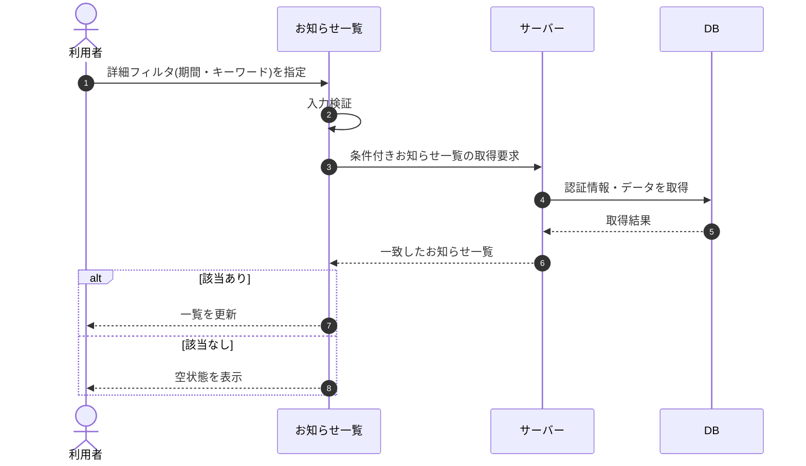

# SEQ-056: 詳細フィルタを適用

> **このページは、業務ユースケース UC-043（詳細フィルタを適用）のシーケンス図を定義します。**

| ID | 業務ユースケースID | イベント(画面ID EVT-NN) | テーブルID |
|----|----|----|----|
| SEQ-056 | [UC-043](../../01_requirements/04_business_usecases/UC-043.md#UC-043) | SCR-016 EVT-04 | [TBL-010](../02_backend/04_database/TBL-010.md#TBL-010) ・ [TBL-021](../02_backend/04_database/TBL-021.md#TBL-021) ・ [TBL-022](../02_backend/04_database/TBL-022.md#TBL-022) |

## 概要

利用者がお知らせ一覧で詳細フィルタ(期間・キーワード)を指定すると、サーバーが条件に一致するお知らせを取得して一覧を更新する。一致が 0 件のときは空状態を表示する。

## シーケンス図

## 備考

- 本図は基本設計レベルの抽象度(ユーザー / 画面 / サーバー、システム起点は外部システム・スケジューラ・バッチを加える)で記述する。DB 操作は DB アクターへのメッセージで表し、テーブル別 CRUD は本図に書かず 関連テーブル 欄で示す。
- 図の出典は業務ユースケース [UC-043](../../01_requirements/04_business_usecases/UC-043.md#UC-043)。画面イベントとの対応は UC-043 を参照。
