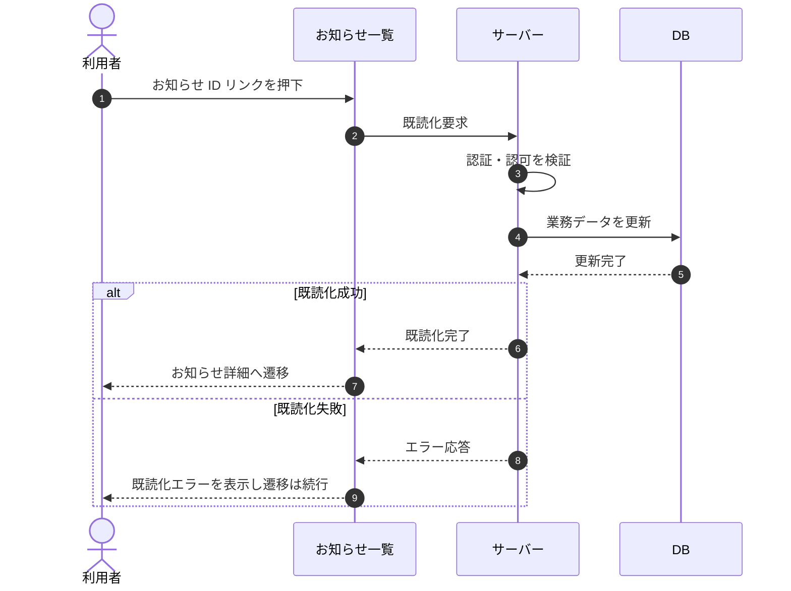

# SEQ-057: お知らせ ID リンクを押下

> **このページは、業務ユースケース UC-045（お知らせ ID リンクを押下）のシーケンス図を定義します。**

| ID | 業務ユースケースID | イベント(画面ID EVT-NN) | テーブルID |
|----|----|----|----|
| SEQ-057 | [UC-045](../../01_requirements/04_business_usecases/UC-045.md#UC-045) | SCR-016 EVT-06 | [TBL-010](../02_backend/04_database/TBL-010.md#TBL-010) ・ [TBL-021](../02_backend/04_database/TBL-021.md#TBL-021) ・ [TBL-022](../02_backend/04_database/TBL-022.md#TBL-022) ・ [TBL-027](../02_backend/04_database/TBL-027.md#TBL-027) |

## 概要

利用者がお知らせ一覧で対象お知らせの ID リンクを押下すると、サーバーが当該お知らせを既読化し、お知らせ詳細画面へ遷移する。

## シーケンス図

## 備考

- 本図は基本設計レベルの抽象度(ユーザー / 画面 / サーバー、システム起点は外部システム・スケジューラ・バッチを加える)で記述する。DB 操作は DB アクターへのメッセージで表し、テーブル別 CRUD は本図に書かず 関連テーブル 欄で示す。
- 図の出典は業務ユースケース [UC-045](../../01_requirements/04_business_usecases/UC-045.md#UC-045)。画面イベントとの対応は UC-045 を参照。
