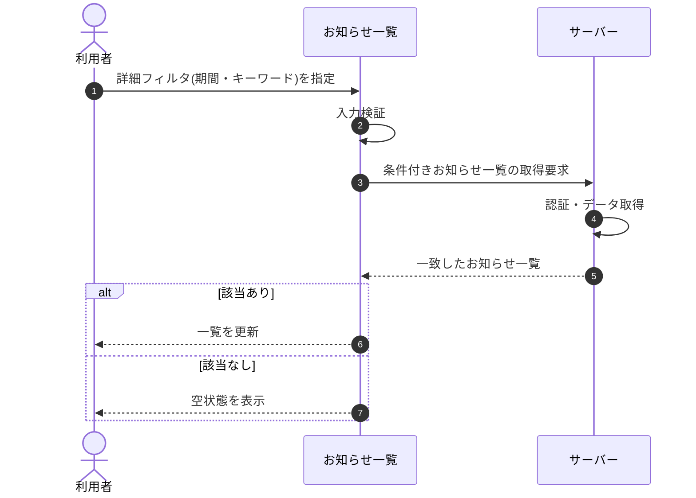

# SEQ-057: 詳細フィルタを適用

> **このページは、業務ユースケース UC-045（詳細フィルタを適用）のシーケンス図を定義します。**

## 項目

| 項目 | 内容 |
|---|---|
| SEQ ID | `SEQ-057` |
| 対応業務ユースケース | [UC-045](../../01_requirements/04_business_usecases/UC-045.md#UC-045) |
| 業務要件 (BR) | [BR-107](../../01_requirements/01_business_requirement/05_notification-br.md#BR-107) ・ [BR-109](../../01_requirements/01_business_requirement/05_notification-br.md#BR-109) ・ [BR-113](../../01_requirements/01_business_requirement/05_notification-br.md#BR-113) |
| 機能要件 (FR) | [FR-156](../../01_requirements/02_functional_requirement/05_notification-fr.md#FR-156)　・　[FR-155](../../01_requirements/02_functional_requirement/05_notification-fr.md#FR-155)　・　[FR-173](../../01_requirements/02_functional_requirement/03_usage-fr.md#FR-173) |
| 画面イベント (EVT) | [EVT-139](../01_frontend/02_screen_events/EVT-139.md#EVT-139) |
| 関連画面 | [SCR-016](../01_frontend/01_screens/SCR-016.md#SCR-016) |
| 関連 API | [API-048](../02_backend/03_apis/API-048.md#API-048) |
| 関連テーブル | [TBL-010](../02_backend/04_database/TBL-010.md#TBL-010) ・ [TBL-021](../02_backend/04_database/TBL-021.md#TBL-021) |
| エラー (ERR) | — |
| メッセージ (MSG) | — |

## 概要

利用者がお知らせ一覧で詳細フィルタ(期間・キーワード)を指定すると、サーバーが条件に一致するお知らせを取得して一覧を更新する。一致が 0 件のときは空状態を表示する。

## シーケンス図

## 備考

- 本図は基本設計レベルの抽象度(ユーザー / 画面 / サーバー、システム起点は外部システム・スケジューラ・バッチを加える)で記述する。DB 操作はサーバー自己メッセージで表し、テーブル別 CRUD は本図に書かず 関連テーブル 欄で示す。
- 図の出典は業務ユースケース [UC-045](../../01_requirements/04_business_usecases/UC-045.md#UC-045)。画面イベントとの対応は UC-045 を参照。
