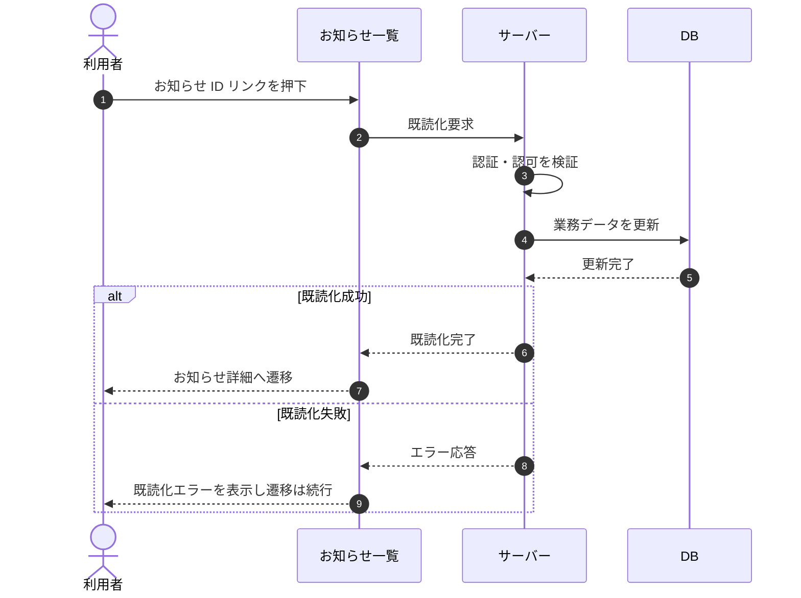

# SEQ-058: お知らせ ID リンクを押下

> **このページは、業務ユースケース UC-046（お知らせ ID リンクを押下）のシーケンス図を定義します。**

## 項目

| 項目 | 内容 |
|---|---|
| SEQ ID | `SEQ-058` |
| トレーサビリティID | [TR-046](../00_traceability/index.md#TR-046) |
| 画面イベント (EVT) | EVT-141 |
| 関連画面 | [SCR-016](../01_frontend/01_screens/SCR-016.md#SCR-016) ・ [SCR-017](../01_frontend/01_screens/SCR-017.md#SCR-017) |
| 関連 API | [API-049](../02_backend/03_apis/API-049.md#API-049) |
| 関連テーブル | [TBL-021](../02_backend/04_database/TBL-021.md#TBL-021) |
| エラー (ERR) | — |
| メッセージ (MSG) | — |

## 概要

利用者がお知らせ一覧で対象お知らせの ID リンクを押下すると、サーバーが当該お知らせを既読化し、お知らせ詳細画面へ遷移する。

## シーケンス図

## 備考

- 本図は基本設計レベルの抽象度(ユーザー / 画面 / サーバー、システム起点は外部システム・スケジューラ・バッチを加える)で記述する。DB 操作は DB アクターへのメッセージで表し、テーブル別 CRUD は本図に書かず 関連テーブル 欄で示す。
- 図の出典は業務ユースケース [UC-046](../../01_requirements/04_business_usecases/UC-046.md#UC-046)。画面イベントとの対応は UC-046 を参照。
