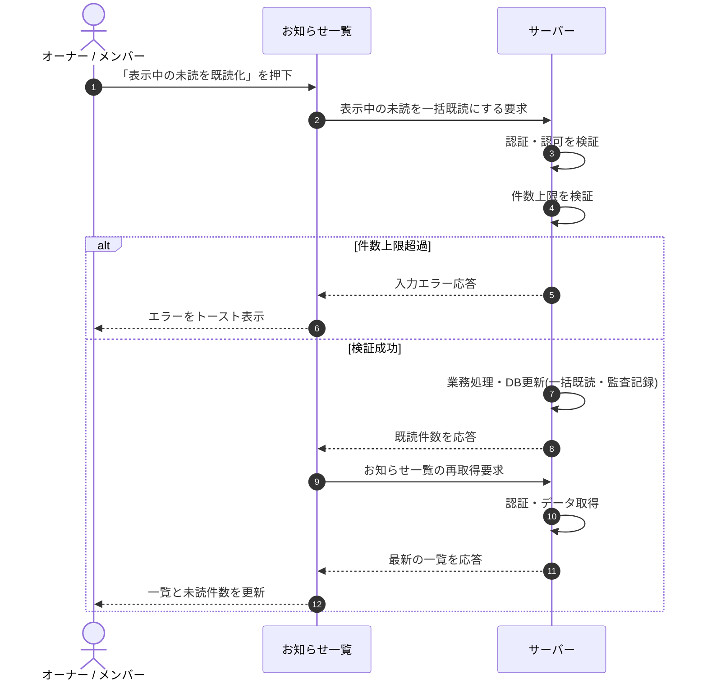

<!-- portal-top -->
[設計ポータル](../../README.md) ／ [基本設計](../index.md) ／ [シーケンス設計](index.md) ／ **SEQ-060: 「表示中の未読を既読化」を押下**
<!-- /portal-top -->

# SEQ-060: 「表示中の未読を既読化」を押下

> **このページは、業務ユースケース UC-047（「表示中の未読を既読化」を押下）のシーケンス図を定義します。**

*版数 v2.0 ・ 更新 2026-06-23 ・ ステータス ドラフト*

## 項目

| 項目 | 内容 |
|---|---|
| SEQ ID | `SEQ-060` |
| 対応業務ユースケース | [UC-047](../../01_requirements/04_business_usecases/UC-047.md#UC-047) |
| 業務要件 (BR) | [BR-109](../../01_requirements/01_BusinessRequirement/05_notification-br.md#BR-109) ・ [BR-115](../../01_requirements/01_BusinessRequirement/05_notification-br.md#BR-115) |
| 機能要件 (FR) | [FR-156](../../01_requirements/02_FunctionalRequirement/05_notification-fr.md#FR-156) |
| 画面イベント (EVT) | [EVT-143](../01_frontend/02_screen_events/EVT-143.md#EVT-143) |
| 関連画面 | [SCR-016](../01_frontend/01_screens/SCR-016.md#SCR-016) |
| 関連 API | [API-048](../02_backend/03_apis/API-048.md#API-048) ・ [API-050](../02_backend/03_apis/API-050.md#API-050) |
| 関連テーブル | [TBL-010](../02_backend/04_database/TBL-010.md#TBL-010) ・ [TBL-021](../02_backend/04_database/TBL-021.md#TBL-021) |
| エラー (ERR) | [ERR-001](../05_errors/ERR-001.md#ERR-001) |
| メッセージ (MSG) | — |

## 概要

お知らせ一覧で「表示中の未読を既読化」を押下し、現在のフィルタ条件で表示中の未読を一括既読にする。完了後に一覧を再取得し、未読件数を更新する。

## シーケンス図

## 例外フロー

- 件数上限(1 リクエスト 100 件)を超過した場合は入力エラーを返し、画面はエラーをトースト表示する。
- 既読済みのお知らせは再度既読にしても結果が変わらない（冪等）。

## 備考

- 本図は基本設計レベルの抽象度(ユーザー / 画面 / サーバー、システム起点は外部システム・スケジューラ・バッチを加える)で記述する。DB 操作はサーバー自己メッセージで表し、テーブル別 CRUD は本図に書かず 関連テーブル 欄で示す。
- 図の出典は業務ユースケース [UC-047](../../01_requirements/04_business_usecases/UC-047.md#UC-047)。画面イベントとの対応は UC-047 を参照。

---

<!-- portal-bottom -->
[← シーケンス設計](index.md) ・ [基本設計](../index.md) ・ [↑ 設計ポータル](../../README.md)
<!-- /portal-bottom -->
