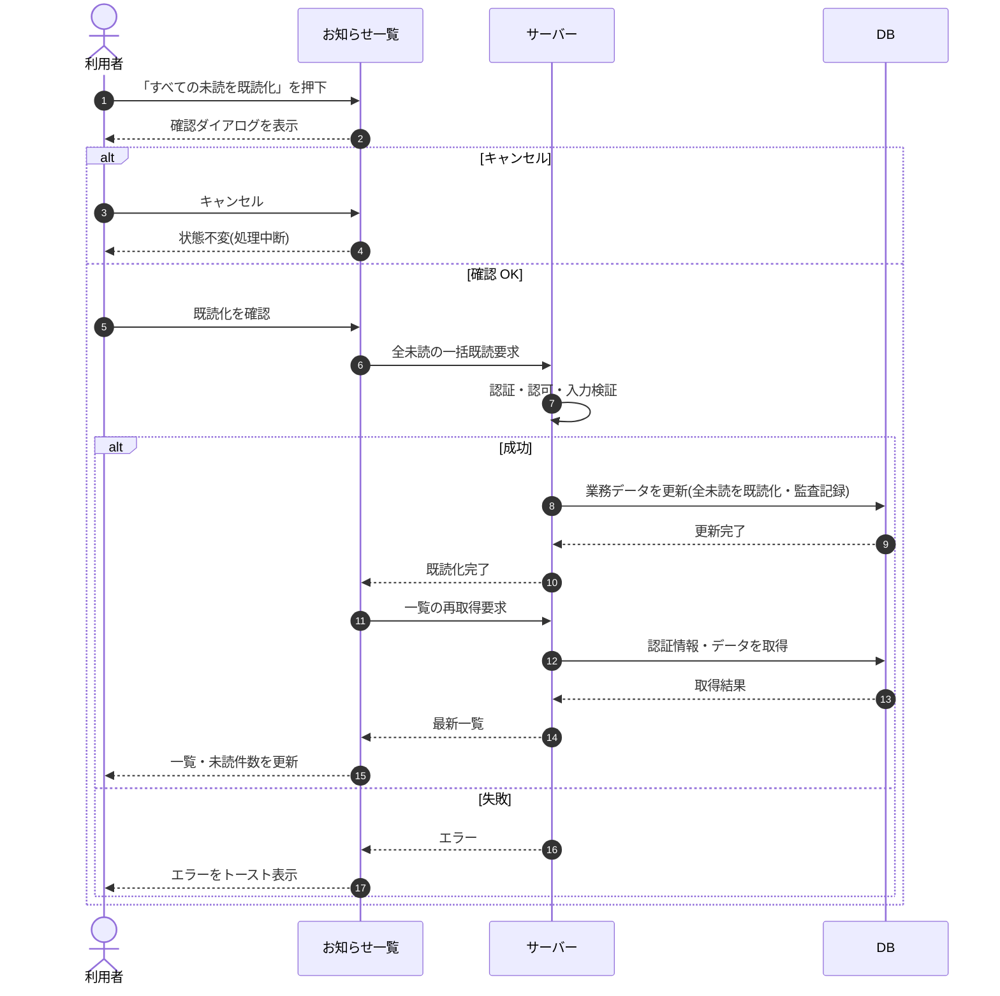

# SEQ-061: 「すべての未読を既読化」を押下

> **このページは、業務ユースケース UC-046（「すべての未読を既読化」を押下）のシーケンス図を定義します。**

| ID | シーケンス名 |
|----|----|
| SEQ-061 | 「すべての未読を既読化」を押下 |

| 関連項目 | 内容 |
|----|----| 
| 業務ユースケース | [UC-046](../../01_requirements/04_business_usecases/UC-046.md#UC-046) |
| イベント | [SCR-016 EVT-09](../01_frontend/01_screens/SCR-016.md#SCR-016) |
| 関連画面 | [SCR-016](../01_frontend/01_screens/SCR-016.md#SCR-016) |
| 関連API | [API-048](../02_backend/03_apis/API-048.md#API-048) / [API-050](../02_backend/03_apis/API-050.md#API-050) |
| テーブル | [TBL-010](../02_backend/04_database/TBL-010.md#TBL-010) / [TBL-021](../02_backend/04_database/TBL-021.md#TBL-021) |
| エラー(ERR) | [ERR-001](../05_errors/ERR-001.md#ERR-001) |
| メッセージ(MSG) | — |

## 概要

お知らせ一覧で「すべての未読を既読化」を押下し、確認後にフィルタを無視して全未読を一括既読化する。完了後は一覧を再取得し、未読件数を更新する。

## シーケンス図

## 例外フロー

- 一括既読の更新がサーバーで失敗した場合、状態を変えずエラーをトースト表示する。
- 既読済みのお知らせは冪等に扱い、二重既読でも状態は変わらない。

## 備考

- 本図は基本設計レベルの抽象度(ユーザー / 画面 / サーバー、システム起点は外部システム・スケジューラ・バッチを加える)で記述する。DB 操作は DB アクターへのメッセージで表し、テーブル別 CRUD は本図に書かず 関連テーブル 欄で示す。
- 図の出典は業務ユースケース [UC-046](../../01_requirements/04_business_usecases/UC-046.md#UC-046)。画面イベントとの対応は UC-046 を参照。
