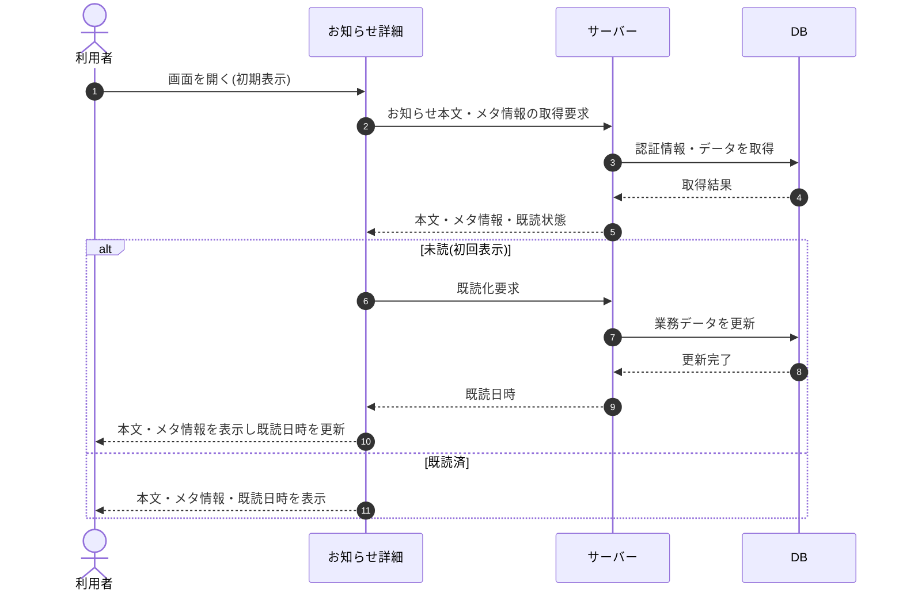

# SEQ-062: 初期表示

> **このページは、業務ユースケース UC-044（初期表示）のシーケンス図を定義します。**

| ID | 業務ユースケースID | イベント(画面ID EVT-NN) | テーブルID |
|----|----|----|----|
| SEQ-062 | [UC-044](../../01_requirements/04_business_usecases/UC-044.md#UC-044) | SCR-017 EVT-01 | [TBL-010](../02_backend/04_database/TBL-010.md#TBL-010) ・ [TBL-021](../02_backend/04_database/TBL-021.md#TBL-021) ・ [TBL-022](../02_backend/04_database/TBL-022.md#TBL-022) |

## 概要

お知らせ詳細を開いたときに、本文とメタ情報(種別・重要度・配信日時・既読日時)を表示する。初回表示(未読)のときは自動で既読化し、既読日時を更新表示する。

## シーケンス図

## 備考

- 本図は基本設計レベルの抽象度(ユーザー / 画面 / サーバー、システム起点は外部システム・スケジューラ・バッチを加える)で記述する。DB 操作は DB アクターへのメッセージで表し、テーブル別 CRUD は本図に書かず 関連テーブル 欄で示す。
- 図の出典は業務ユースケース [UC-044](../../01_requirements/04_business_usecases/UC-044.md#UC-044)。画面イベントとの対応は UC-044 を参照。
