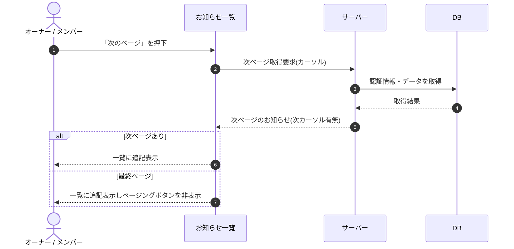

# SEQ-062: 「次のページ」を押下

> **このページは、業務ユースケース UC-044（「次のページ」を押下）のシーケンス図を定義します。**

## 項目

| 項目 | 内容 |
|---|---|
| SEQ ID | `SEQ-062` |
| トレーサビリティID | [TR-044](../00_traceability/index.md#TR-044) |
| 画面イベント (EVT) | EVT-126 |
| 関連画面 | [SCR-016](../01_frontend/01_screens/SCR-016.md#SCR-016) |
| 関連 API | [API-048](../02_backend/03_apis/API-048.md#API-048) |
| 関連テーブル | [TBL-010](../02_backend/04_database/TBL-010.md#TBL-010) ・ [TBL-021](../02_backend/04_database/TBL-021.md#TBL-021) |
| エラー (ERR) | — |
| メッセージ (MSG) | — |

## 概要

お知らせ一覧で「次のページ」を押下すると、カーソル方式で次ページを取得して一覧に追記表示する。最終ページに到達したときはページングボタンを非表示にする。

## シーケンス図

## 備考

- 本図は基本設計レベルの抽象度(ユーザー / 画面 / サーバー、システム起点は外部システム・スケジューラ・バッチを加える)で記述する。DB 操作は DB アクターへのメッセージで表し、テーブル別 CRUD は本図に書かず 関連テーブル 欄で示す。
- 図の出典は業務ユースケース [UC-044](../../01_requirements/04_business_usecases/UC-044.md#UC-044)。画面イベントとの対応は UC-044 を参照。
