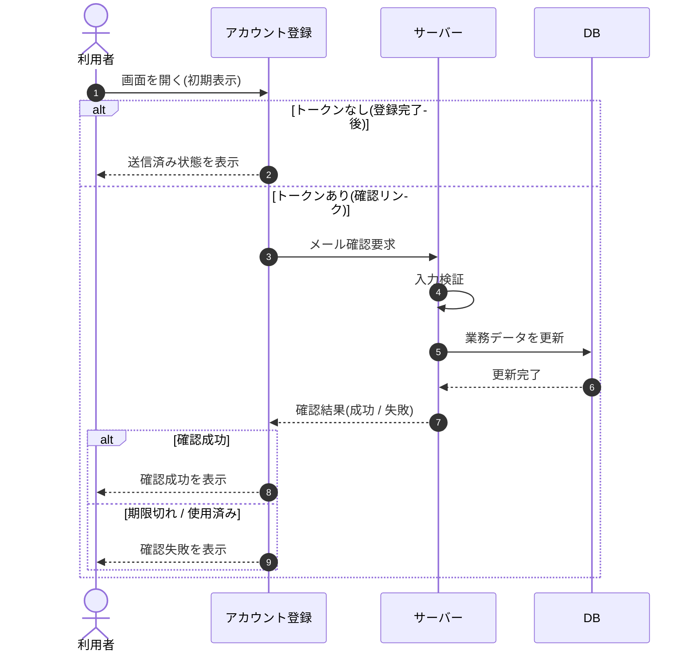

# SEQ-063: 初期表示

> **このページは、業務ユースケース UC-003（初期表示）のシーケンス図を定義します。**

| ID | 業務ユースケースID | イベント(画面ID EVT-NN) | テーブルID |
|----|----|----|----|
| SEQ-063 | [UC-003](../../01_requirements/04_business_usecases/UC-003.md#UC-003) | SCR-018 EVT-01 | [TBL-001](../02_backend/04_database/TBL-001.md#TBL-001) ・ [TBL-002](../02_backend/04_database/TBL-002.md#TBL-002) ・ [TBL-014](../02_backend/04_database/TBL-014.md#TBL-014) ・ [TBL-024](../02_backend/04_database/TBL-024.md#TBL-024) |

## 概要

URL パラメータに確認トークンが無い場合は送信済み状態を表示し、確認トークンがある場合はサーバーで検証してメール確認状態を更新し、成功 / 失敗の結果を表示する。

## シーケンス図

## 例外フロー

- 確認トークンが期限切れ、または使用済みの場合、確認失敗を表示し、新規登録からのやり直しへ導く（有効期限は [システム仕様書 §4](../07_system-spec.md#4-データ保持期間削除猶予) 参照）。

## 備考

- 本図は基本設計レベルの抽象度(ユーザー / 画面 / サーバー、システム起点は外部システム・スケジューラ・バッチを加える)で記述する。DB 操作は DB アクターへのメッセージで表し、テーブル別 CRUD は本図に書かず 関連テーブル 欄で示す。
- 図の出典は業務ユースケース [UC-003](../../01_requirements/04_business_usecases/UC-003.md#UC-003)。画面イベントとの対応は UC-003 を参照。
