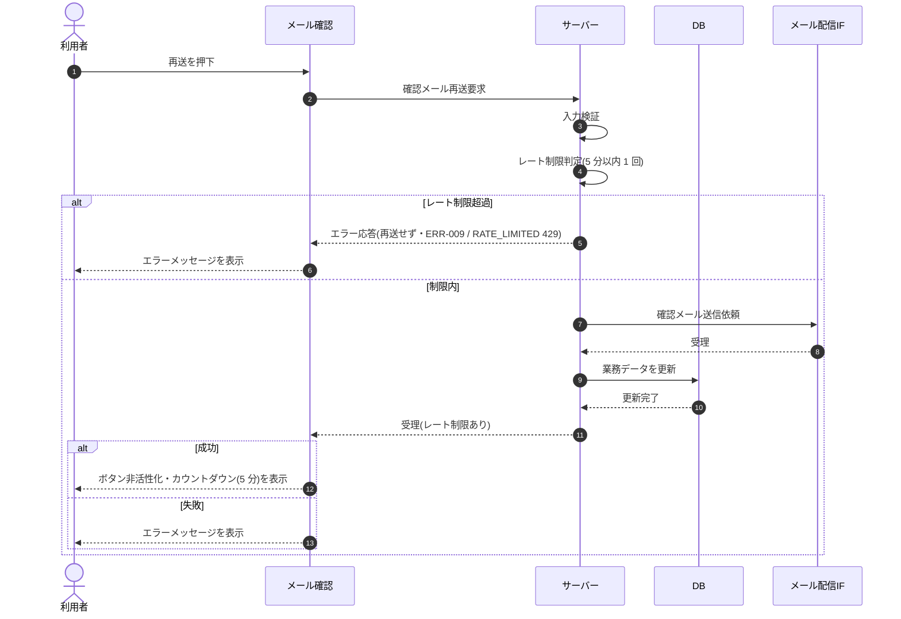

# SEQ-064: 「メールを再送する」を押下

> **このページは、業務ユースケース UC-003（「メールを再送する」を押下）のシーケンス図を定義します。**

| ID | 業務ユースケースID | イベント(画面ID EVT-NN) | テーブルID |
|----|----|----|----|
| SEQ-064 | [UC-003](../../01_requirements/04_business_usecases/UC-003.md#UC-003) | SCR-018 EVT-02 | [TBL-001](../02_backend/04_database/TBL-001.md#TBL-001) ・ [TBL-002](../02_backend/04_database/TBL-002.md#TBL-002) ・ [TBL-014](../02_backend/04_database/TBL-014.md#TBL-014) ・ [TBL-024](../02_backend/04_database/TBL-024.md#TBL-024) |

## 概要

メール確認画面で再送を押下すると、サーバーが確認メールを再送する。成功時は画面が再送ボタンを非活性化し、レート制限のカウントダウン(5 分)を表示する。

## シーケンス図

## 例外フロー

- レート制限中(5 分以内の再送間隔未到達)は再送せずエラー応答([ERR-009](../05_errors/ERR-009.md#ERR-009) / RATE_LIMITED 429)を返し、再送ボタンを非活性のままとしてカウントダウン終了で再活性化する。
- 確認メールの再送に失敗した場合はエラーメッセージを表示する。

## 備考

- 本図は基本設計レベルの抽象度(ユーザー / 画面 / サーバー、システム起点は外部システム・スケジューラ・バッチを加える)で記述する。DB 操作は DB アクターへのメッセージで表し、テーブル別 CRUD は本図に書かず 関連テーブル 欄で示す。
- 図の出典は業務ユースケース [UC-003](../../01_requirements/04_business_usecases/UC-003.md#UC-003)。画面イベントとの対応は UC-003 を参照。
