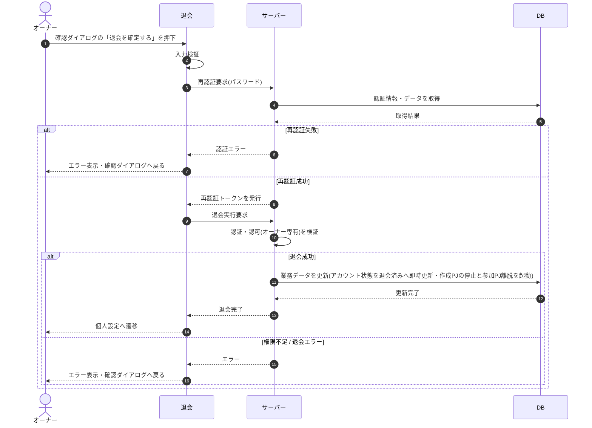

# SEQ-065: 確認ダイアログの「退会を確定する」を押下

> **このページは、業務ユースケース UC-022（オーナーが退会する）のシーケンス図を定義します。**

| ID | 業務ユースケースID | イベント(画面ID EVT-NN) | テーブルID |
|----|----|----|----|
| SEQ-065 | [UC-022](../../01_requirements/04_business_usecases/UC-022.md#UC-022) | SCR-019 EVT-03 | [TBL-002](../02_backend/04_database/TBL-002.md#TBL-002) ・ [TBL-003](../02_backend/04_database/TBL-003.md#TBL-003) ・ [TBL-014](../02_backend/04_database/TBL-014.md#TBL-014) ・ [TBL-023](../02_backend/04_database/TBL-023.md#TBL-023) |

## 概要

オーナーが退会内容の確認ダイアログで「退会を確定する」を押下し、再認証を経て退会を即時実行する。成功時はアカウント状態を退会済みへ即時更新し、自分が作成したプロジェクトの停止（ウィジェット停止）と参加プロジェクトからの離脱を起動したうえで個人設定画面へ遷移、失敗時は確認ダイアログへ戻る。

## シーケンス図

## 例外フロー

- 再認証でパスワードが不一致の場合は認証エラーを表示し、確認ダイアログへ戻る。
- オーナー以外(メンバー)が退会を試みた場合は権限不足として拒否し、エラーを表示する。

## 備考

- 本図は基本設計レベルの抽象度(ユーザー / 画面 / サーバー、システム起点は外部システム・スケジューラ・バッチを加える)で記述する。DB 操作は DB アクターへのメッセージで表し、テーブル別 CRUD は本図に書かず 関連テーブル 欄で示す。
- 図の出典は業務ユースケース [UC-022](../../01_requirements/04_business_usecases/UC-022.md#UC-022)。画面イベントとの対応は UC-022 を参照。
