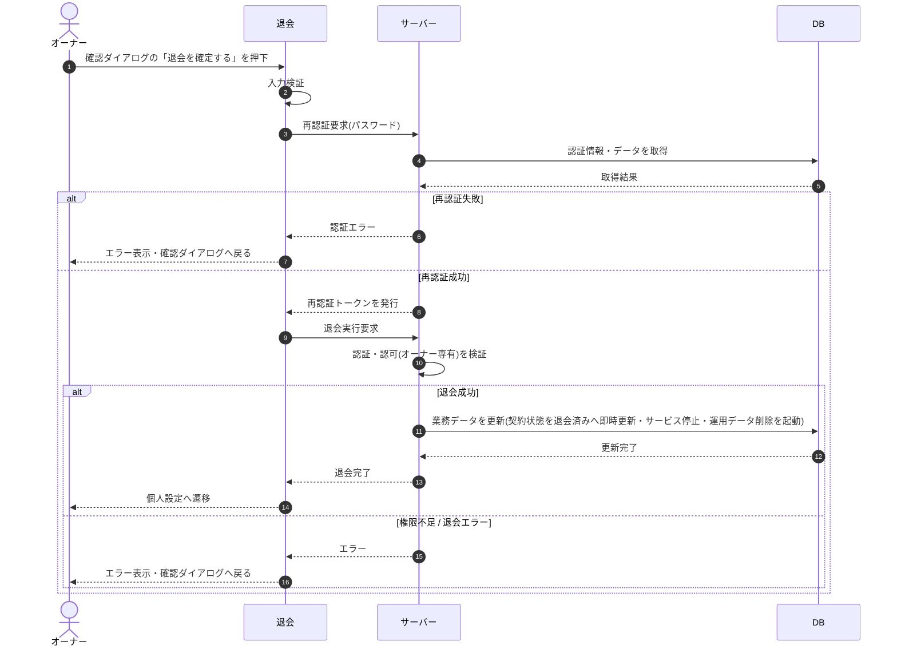

# SEQ-066: 確認ダイアログの「退会を確定する」を押下

> **このページは、業務ユースケース UC-023（オーナーが退会する）のシーケンス図を定義します。**

## 項目

| 項目 | 内容 |
|---|---|
| SEQ ID | `SEQ-066` |
| トレーサビリティID | [TR-023](../00_traceability/index.md#TR-023) |
| 画面イベント (EVT) | EVT-145 |
| 関連画面 | [SCR-019](../01_frontend/01_screens/SCR-019.md#SCR-019) ・ [SCR-022](../01_frontend/01_screens/SCR-022.md#SCR-022) |
| 関連 API | [API-005](../02_backend/03_apis/API-005.md#API-005) ・ [API-056](../02_backend/03_apis/API-056.md#API-056) |
| 関連テーブル | [TBL-002](../02_backend/04_database/TBL-002.md#TBL-002) ・ [TBL-023](../02_backend/04_database/TBL-023.md#TBL-023) |
| エラー (ERR) | [ERR-007](../05_errors/ERR-007.md#ERR-007) ・ [ERR-032](../05_errors/ERR-032.md#ERR-032) |
| メッセージ (MSG) | — |

## 概要

オーナーが退会内容の確認ダイアログで「退会を確定する」を押下し、再認証を経て退会を即時実行する。成功時は契約状態を退会済みへ即時更新してサービスを停止し、運用データの削除を起動したうえで個人設定画面へ遷移、失敗時は確認ダイアログへ戻る。

## シーケンス図

## 例外フロー

- 再認証でパスワードが不一致の場合は認証エラーを表示し、確認ダイアログへ戻る。
- オーナー以外(メンバー)が退会を試みた場合は権限不足として拒否し、エラーを表示する。

## 備考

- 本図は基本設計レベルの抽象度(ユーザー / 画面 / サーバー、システム起点は外部システム・スケジューラ・バッチを加える)で記述する。DB 操作は DB アクターへのメッセージで表し、テーブル別 CRUD は本図に書かず 関連テーブル 欄で示す。
- 図の出典は業務ユースケース [UC-023](../../01_requirements/04_business_usecases/UC-023.md#UC-023)。画面イベントとの対応は UC-023 を参照。
