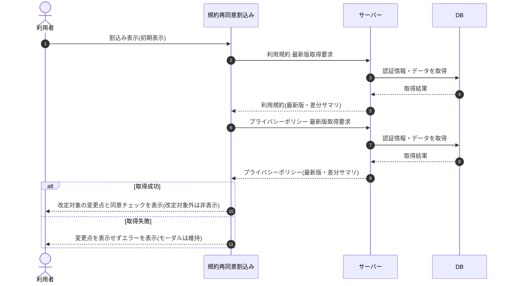

# SEQ-066: 初期表示

> **このページは、業務ユースケース UC-013（初期表示）のシーケンス図を定義します。**

| ID | シーケンス名 |
|----|----|
| SEQ-066 | 初期表示 |

| 関連項目 | 内容 |
|----|----| 
| 業務ユースケース | [UC-013](../../01_requirements/04_business_usecases/UC-013.md#UC-013) |
| イベント | [SCR-020 EVT-01](../01_frontend/01_screens/SCR-020.md#SCR-020) |
| 関連画面 | [SCR-020](../01_frontend/01_screens/SCR-020.md#SCR-020) |
| 関連API | [API-052](../02_backend/03_apis/API-052.md#API-052) / [API-053](../02_backend/03_apis/API-053.md#API-053) |
| テーブル | [TBL-012](../02_backend/04_database/TBL-012.md#TBL-012) |
| エラー(ERR) | — |
| メッセージ(MSG) | — |

## 概要

未同意の規約改定がある状態で割込み表示された規約再同意割込み画面が、利用規約・プライバシーポリシーの最新版と差分サマリをサーバーから取得する。改定対象文書の主な変更点と同意チェックを全画面モーダルで表示し、改定対象外の文書の同意チェックは非表示にする。

## シーケンス図

## 例外フロー

- 利用規約またはプライバシーポリシーの取得に失敗した場合、変更点を表示せずエラーを表示する(モーダルは維持する)。

## 備考

- 本図は基本設計レベルの抽象度(ユーザー / 画面 / サーバー、システム起点は外部システム・スケジューラ・バッチを加える)で記述する。DB 操作は DB アクターへのメッセージで表し、テーブル別 CRUD は本図に書かず 関連テーブル 欄で示す。
- 図の出典は業務ユースケース [UC-013](../../01_requirements/04_business_usecases/UC-013.md#UC-013)。画面イベントとの対応は UC-013 を参照。
