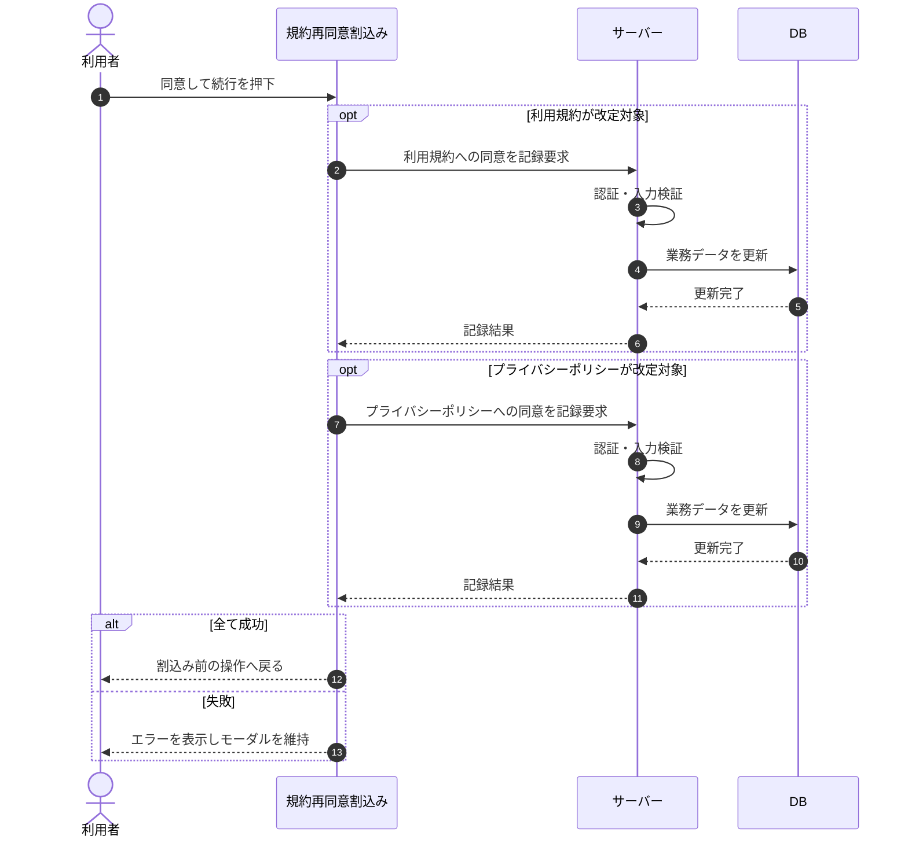

# SEQ-067: 「同意して続行する」を押下

> **このページは、業務ユースケース UC-013（「同意して続行する」を押下）のシーケンス図を定義します。**

| ID | 業務ユースケースID | イベント(画面ID EVT-NN) | テーブルID |
|----|----|----|----|
| SEQ-067 | [UC-013](../../01_requirements/04_business_usecases/UC-013.md#UC-013) | SCR-020 EVT-06 | [TBL-012](../02_backend/04_database/TBL-012.md#TBL-012) ・ [TBL-024](../02_backend/04_database/TBL-024.md#TBL-024) |

## 概要

規約再同意割込み画面で「同意して続行する」を押下すると、改定対象の文書のみを対象にサーバーへ同意を記録し、割込み前の操作へ戻る。失敗時はモーダルを維持しエラーを表示する。

## シーケンス図

## 例外フロー

- 同意の記録に失敗した場合、エラーメッセージを表示し、モーダルはそのまま維持する。

## 備考

- 本図は基本設計レベルの抽象度(ユーザー / 画面 / サーバー、システム起点は外部システム・スケジューラ・バッチを加える)で記述する。DB 操作は DB アクターへのメッセージで表し、テーブル別 CRUD は本図に書かず 関連テーブル 欄で示す。
- 図の出典は業務ユースケース [UC-013](../../01_requirements/04_business_usecases/UC-013.md#UC-013)。画面イベントとの対応は UC-013 を参照。
