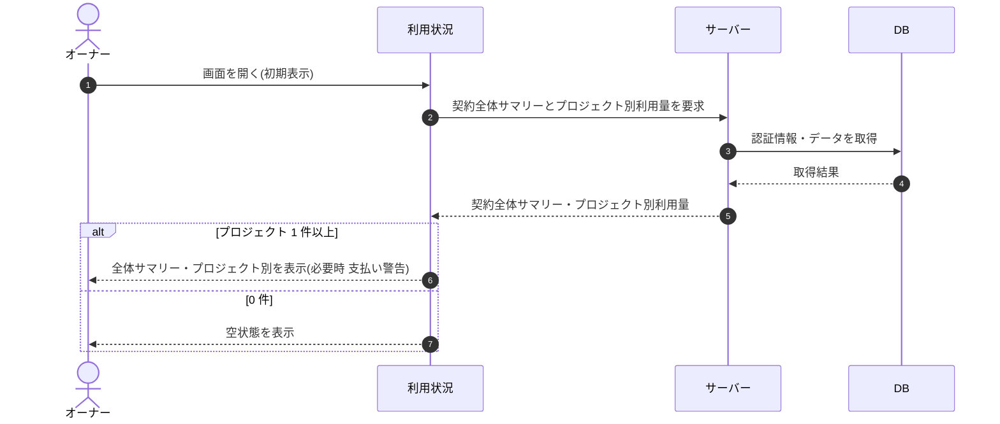

# SEQ-069: 初期表示

> **このページは、業務ユースケース UC-036（初期表示）のシーケンス図を定義します。**

## 項目

| 項目 | 内容 |
|---|---|
| SEQ ID | `SEQ-069` |
| トレーサビリティID | [TR-036](../00_traceability/index.md#TR-036) |
| 画面イベント (EVT) | EVT-170 |
| 関連画面 | [SCR-021](../01_frontend/01_screens/SCR-021.md#SCR-021) |
| 関連 API | [API-041](../02_backend/03_apis/API-041.md#API-041) ・ [API-042](../02_backend/03_apis/API-042.md#API-042) |
| 関連テーブル | [TBL-004](../02_backend/04_database/TBL-004.md#TBL-004) ・ [TBL-009](../02_backend/04_database/TBL-009.md#TBL-009) ・ [TBL-018](../02_backend/04_database/TBL-018.md#TBL-018) ・ [TBL-020](../02_backend/04_database/TBL-020.md#TBL-020) |
| エラー (ERR) | — |
| メッセージ (MSG) | — |

## 概要

オーナーが利用状況画面を開くと、契約全体サマリーとプロジェクト別の利用状況を取得して表示する。プロジェクトが 0 件のときは空状態を表示する。

## シーケンス図

## 備考

- 本図は基本設計レベルの抽象度(ユーザー / 画面 / サーバー、システム起点は外部システム・スケジューラ・バッチを加える)で記述する。DB 操作は DB アクターへのメッセージで表し、テーブル別 CRUD は本図に書かず 関連テーブル 欄で示す。
- 図の出典は業務ユースケース [UC-036](../../01_requirements/04_business_usecases/UC-036.md#UC-036)。画面イベントとの対応は UC-036 を参照。
