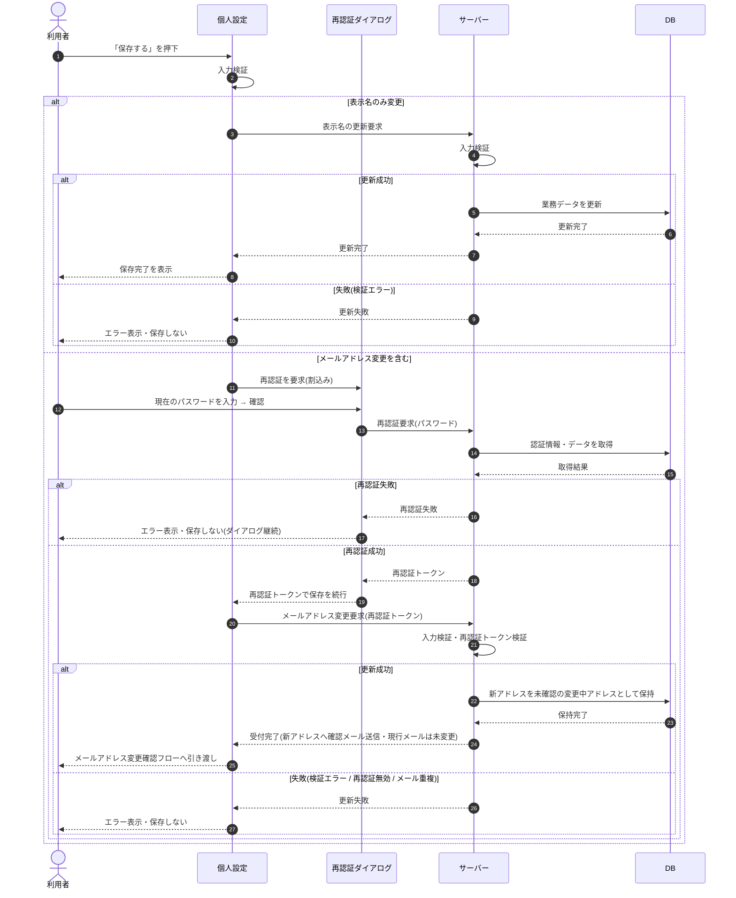

# SEQ-070: 「保存する」を押下(プロフィール)

> **このページは、業務ユースケース UC-009（「保存する」を押下(プロフィール)）のシーケンス図を定義します。**

| ID | シーケンス名 |
|----|----|
| SEQ-070 | 「保存する」を押下(プロフィール) |

| 関連項目 | 内容 |
|----|----| 
| 業務ユースケース | [UC-009](../../01_requirements/04_business_usecases/UC-009.md#UC-009) |
| イベント | [SCR-022 EVT-03](../01_frontend/01_screens/SCR-022.md#SCR-022) |
| 関連画面 | [SCR-018](../01_frontend/01_screens/SCR-018.md#SCR-018) / [SCR-022](../01_frontend/01_screens/SCR-022.md#SCR-022) / [SCR-034](../01_frontend/01_screens/SCR-034.md#SCR-034) |
| 関連API | [API-005](../02_backend/03_apis/API-005.md#API-005) / [API-012](../02_backend/03_apis/API-012.md#API-012) / [API-015](../02_backend/03_apis/API-015.md#API-015) |
| テーブル | [TBL-002](../02_backend/04_database/TBL-002.md#TBL-002) / [TBL-003](../02_backend/04_database/TBL-003.md#TBL-003) |
| エラー(ERR) | [ERR-001](../05_errors/ERR-001.md#ERR-001) / [ERR-005](../05_errors/ERR-005.md#ERR-005) / [ERR-013](../05_errors/ERR-013.md#ERR-013) / [ERR-014](../05_errors/ERR-014.md#ERR-014) |
| メッセージ(MSG) | [MSG-001](../06_messages/MSG-001.md#MSG-001) |

## 概要

認証済みの利用者がプロフィールの表示名・メールアドレスを保存する。表示名のみの変更はそのまま更新して保存完了を表示する。メールアドレス変更を含む場合は再認証ダイアログ(SCR-034)で再認証し、その通過後に新アドレスを未確認の変更中アドレスとして保持し新アドレスへ確認メールを送信して、メールアドレス変更確認フロー(SCR-018)へ引き渡す(現行ログインメールは確認完了まで変わらない)。

## シーケンス図

## 例外フロー

- メールアドレス変更時の再認証ダイアログでパスワード再認証に失敗した場合は更新を中止し、エラーを表示して保存しない(ダイアログは開いたまま再入力を促す)。
- 入力値の検証に失敗した場合は更新を中止し、エラーを表示して保存しない。
- 再認証トークンが無効・未提示の場合はメールアドレス変更を受け付けず、エラーを表示する。
- 入力メールアドレスが既に使用中の場合は更新を中止し、エラーを表示する。
- メールアドレス変更は受付時点では現行ログインメールを変更せず、新アドレスを未確認の変更中アドレスとして保持する。確認メールの確認完了時に初めて現行ログインメールへ確定反映する。

## 備考

- 本図は基本設計レベルの抽象度(ユーザー / 画面 / サーバー、システム起点は外部システム・スケジューラ・バッチを加える)で記述する。DB 操作は DB アクターへのメッセージで表し、テーブル別 CRUD は本図に書かず 関連テーブル 欄で示す。
- 図の出典は業務ユースケース [UC-009](../../01_requirements/04_business_usecases/UC-009.md#UC-009)。画面イベントとの対応は UC-009 を参照。
