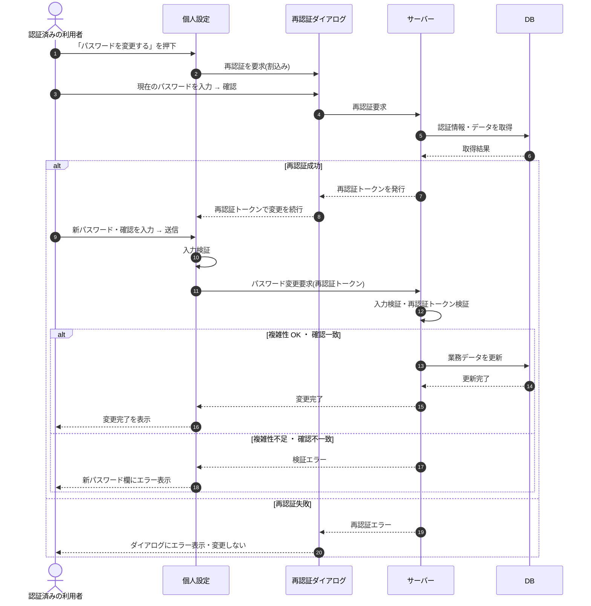

# SEQ-071: 「パスワードを変更する」を押下

> **このページは、業務ユースケース UC-010（「パスワードを変更する」を押下）のシーケンス図を定義します。**

| ID | シーケンス名 |
|----|----|
| SEQ-071 | 「パスワードを変更する」を押下 |

| 関連項目 | 内容 |
|----|----| 
| 業務ユースケース | [UC-010](../../01_requirements/04_business_usecases/UC-010.md#UC-010) |
| イベント | [SCR-022 EVT-04](../01_frontend/01_screens/SCR-022.md#SCR-022) |
| 関連画面 | [SCR-022](../01_frontend/01_screens/SCR-022.md#SCR-022) / [SCR-034](../01_frontend/01_screens/SCR-034.md#SCR-034) |
| 関連API | [API-005](../02_backend/03_apis/API-005.md#API-005) / [API-013](../02_backend/03_apis/API-013.md#API-013) |
| テーブル | [TBL-002](../02_backend/04_database/TBL-002.md#TBL-002) / [TBL-003](../02_backend/04_database/TBL-003.md#TBL-003) |
| エラー(ERR) | [ERR-001](../05_errors/ERR-001.md#ERR-001) / [ERR-005](../05_errors/ERR-005.md#ERR-005) / [ERR-013](../05_errors/ERR-013.md#ERR-013) |
| メッセージ(MSG) | — |

## 概要

認証済みの利用者が個人設定画面でパスワード変更を要求し、再認証ダイアログ(SCR-034)で再認証を通過したうえで新しいパスワードと確認入力を送信して自身のパスワードを更新する。

## シーケンス図

## 例外フロー

- 再認証で現在のパスワードが一致しない場合、再認証トークンを発行せず再認証ダイアログにエラーを表示し、パスワードを変更しない。
- 新パスワードが強度要件を満たさない、または確認入力と一致しない場合、検証エラーを返し新パスワード欄にエラーを表示する。

## 備考

- 本図は基本設計レベルの抽象度(ユーザー / 画面 / サーバー、システム起点は外部システム・スケジューラ・バッチを加える)で記述する。DB 操作は DB アクターへのメッセージで表し、テーブル別 CRUD は本図に書かず 関連テーブル 欄で示す。
- 図の出典は業務ユースケース [UC-010](../../01_requirements/04_business_usecases/UC-010.md#UC-010)。画面イベントとの対応は UC-010 を参照。
