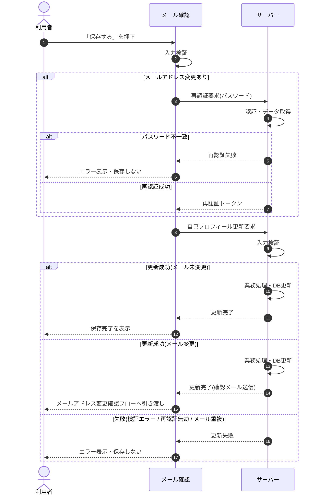

<!-- portal-top -->
[設計ポータル](../../README.md) ／ [基本設計](../index.md) ／ [シーケンス設計](index.md) ／ **SEQ-071: 「保存する」を押下(プロフィール)**
<!-- /portal-top -->

# SEQ-071: 「保存する」を押下(プロフィール)

> **このページは、業務ユースケース UC-009（「保存する」を押下(プロフィール)）のシーケンス図を定義します。**

*版数 v2.0 ・ 更新 2026-06-23 ・ ステータス ドラフト*

## 項目

| 項目 | 内容 |
|---|---|
| SEQ ID | `SEQ-071` |
| 対応業務ユースケース | [UC-009](../../01_requirements/04_business_usecases/UC-009.md#UC-009) |
| 業務要件 (BR) | [BR-002](../../01_requirements/01_business_requirement/01_account-br.md#BR-002) |
| 機能要件 (FR) | [FR-005](../../01_requirements/02_functional_requirement/01_account-fr.md#FR-005) |
| 画面イベント (EVT) | [EVT-177](../01_frontend/02_screen_events/EVT-177.md#EVT-177) |
| 関連画面 | [SCR-018](../01_frontend/01_screens/SCR-018.md#SCR-018) ・ [SCR-022](../01_frontend/01_screens/SCR-022.md#SCR-022) |
| 関連 API | [API-005](../02_backend/03_apis/API-005.md#API-005) ・ [API-012](../02_backend/03_apis/API-012.md#API-012) |
| 関連テーブル | [TBL-002](../02_backend/04_database/TBL-002.md#TBL-002) ・ [TBL-003](../02_backend/04_database/TBL-003.md#TBL-003) |
| エラー (ERR) | [ERR-001](../05_errors/ERR-001.md#ERR-001) ・ [ERR-007](../05_errors/ERR-007.md#ERR-007) ・ [ERR-015](../05_errors/ERR-015.md#ERR-015) ・ [ERR-016](../05_errors/ERR-016.md#ERR-016) |
| メッセージ (MSG) | [MSG-001](../06_messages/MSG-001.md#MSG-001) |

## 概要

認証済みの利用者がプロフィールの表示名・メールアドレスを保存する。メールアドレス未変更時はそのまま更新して保存完了を表示し、メールアドレス変更時は再認証通過後に新アドレスへ確認メールを送信してメールアドレス変更確認フローへ引き渡す。

## シーケンス図

## 例外フロー

- パスワード再認証に失敗した場合は更新を中止し、エラーを表示して保存しない。
- 入力値の検証に失敗した場合は更新を中止し、エラーを表示して保存しない。
- 再認証トークンが無効・未提示の場合はメールアドレス変更を受け付けず、エラーを表示する。
- 入力メールアドレスが既に使用中の場合は更新を中止し、エラーを表示する。

## 備考

- 本図は基本設計レベルの抽象度(ユーザー / 画面 / サーバー、システム起点は外部システム・スケジューラ・バッチを加える)で記述する。DB 操作はサーバー自己メッセージで表し、テーブル別 CRUD は本図に書かず 関連テーブル 欄で示す。
- 図の出典は業務ユースケース [UC-009](../../01_requirements/04_business_usecases/UC-009.md#UC-009)。画面イベントとの対応は UC-009 を参照。

---

<!-- portal-bottom -->
[← シーケンス設計](index.md) ・ [基本設計](../index.md) ・ [↑ 設計ポータル](../../README.md)
<!-- /portal-bottom -->
