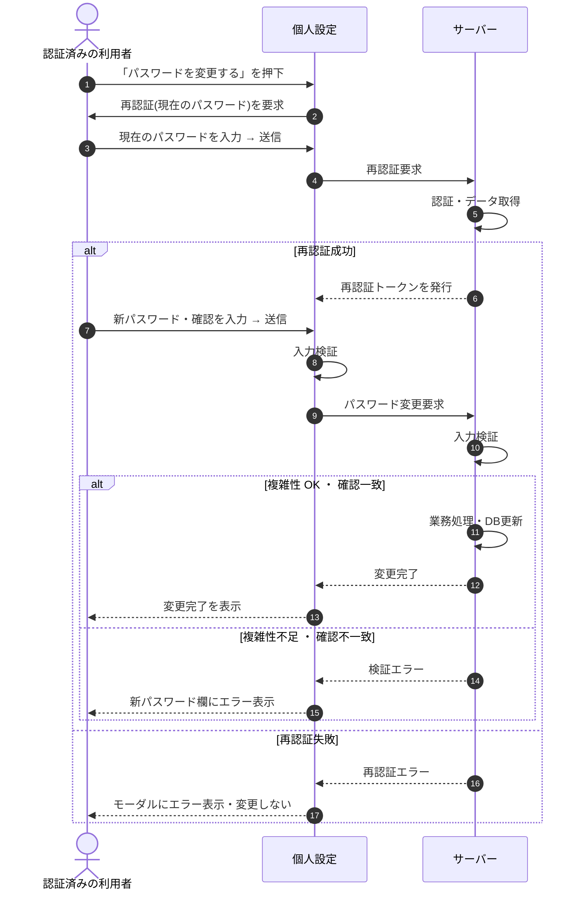

# SEQ-072: 「パスワードを変更する」を押下

> **このページは、業務ユースケース UC-010（「パスワードを変更する」を押下）のシーケンス図を定義します。**

## 項目

| 項目 | 内容 |
|---|---|
| SEQ ID | `SEQ-072` |
| 対応業務ユースケース | [UC-010](../../01_requirements/04_business_usecases/UC-010.md#UC-010) |
| 業務要件 (BR) | [BR-001](../../01_requirements/01_business_requirement/01_account-br.md#BR-001) ・ [BR-002](../../01_requirements/01_business_requirement/01_account-br.md#BR-002) |
| 機能要件 (FR) | [FR-005](../../01_requirements/02_functional_requirement/01_account-fr.md#FR-005) ・ [FR-006](../../01_requirements/02_functional_requirement/01_account-fr.md#FR-006) |
| 画面イベント (EVT) | EVT-178 |
| 関連画面 | [SCR-022](../01_frontend/01_screens/SCR-022.md#SCR-022) |
| 関連 API | [API-005](../02_backend/03_apis/API-005.md#API-005) ・ [API-013](../02_backend/03_apis/API-013.md#API-013) |
| 関連テーブル | [TBL-002](../02_backend/04_database/TBL-002.md#TBL-002) ・ [TBL-003](../02_backend/04_database/TBL-003.md#TBL-003) |
| エラー (ERR) | [ERR-001](../05_errors/ERR-001.md#ERR-001) ・ [ERR-007](../05_errors/ERR-007.md#ERR-007) ・ [ERR-015](../05_errors/ERR-015.md#ERR-015) |
| メッセージ (MSG) | — |

## 概要

認証済みの利用者が個人設定画面でパスワード変更を要求し、再認証を通過したうえで新しいパスワードと確認入力を送信して自身のパスワードを更新する。

## シーケンス図

## 例外フロー

- 再認証で現在のパスワードが一致しない場合、再認証トークンを発行せずモーダルにエラーを表示し、パスワードを変更しない。
- 新パスワードが強度要件を満たさない、または確認入力と一致しない場合、検証エラーを返し新パスワード欄にエラーを表示する。

## 備考

- 本図は基本設計レベルの抽象度(ユーザー / 画面 / サーバー、システム起点は外部システム・スケジューラ・バッチを加える)で記述する。DB 操作はサーバー自己メッセージで表し、テーブル別 CRUD は本図に書かず 関連テーブル 欄で示す。
- 図の出典は業務ユースケース [UC-010](../../01_requirements/04_business_usecases/UC-010.md#UC-010)。画面イベントとの対応は UC-010 を参照。
