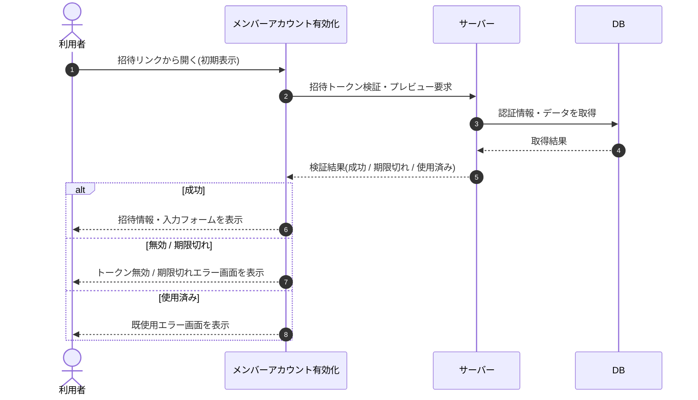

# SEQ-073: 初期表示

> **このページは、業務ユースケース UC-006（初期表示）のシーケンス図を定義します。**

## 項目

| 項目 | 内容 |
|---|---|
| SEQ ID | `SEQ-073` |
| 対応業務ユースケース | [UC-006](../../01_requirements/04_business_usecases/UC-006.md#UC-006) |
| 業務要件 (BR) | [BR-012](../../01_requirements/01_business_requirement/01_account-br.md#BR-012) |
| 機能要件 (FR) | [FR-018](../../01_requirements/02_functional_requirement/01_account-fr.md#FR-018) ・ [FR-019](../../01_requirements/02_functional_requirement/01_account-fr.md#FR-019) ・ [FR-021](../../01_requirements/02_functional_requirement/01_account-fr.md#FR-021) ・ [FR-023](../../01_requirements/02_functional_requirement/01_account-fr.md#FR-023) ・ [FR-032](../../01_requirements/02_functional_requirement/01_account-fr.md#FR-032) |
| 画面イベント (EVT) | EVT-181 |
| 関連画面 | [SCR-023](../01_frontend/01_screens/SCR-023.md#SCR-023) |
| 関連 API | [API-007](../02_backend/03_apis/API-007.md#API-007) |
| 関連テーブル | [TBL-014](../02_backend/04_database/TBL-014.md#TBL-014) |
| エラー (ERR) | [ERR-008](../05_errors/ERR-008.md#ERR-008) ・ [ERR-009](../05_errors/ERR-009.md#ERR-009) ・ [ERR-010](../05_errors/ERR-010.md#ERR-010) |
| メッセージ (MSG) | — |

## 概要

招待リンクから開いた際に招待トークンを検証し、招待情報(プロジェクト名 / 招待元)を取得する。成功時は招待情報パネルと入力フォームを表示し、無効 / 期限切れ・使用済みの場合は各エラー画面を表示する。

## シーケンス図

## 例外フロー

- トークン無効 / 期限切れ: トークン無効 / 期限切れエラー画面を表示する(有効期限 7 日)。
- トークン使用済み: 既使用エラー画面を表示する。
- トークン不存在: トークンが存在しない旨のエラーを表示する。

## 備考

- 本図は基本設計レベルの抽象度(ユーザー / 画面 / サーバー、システム起点は外部システム・スケジューラ・バッチを加える)で記述する。DB 操作は DB アクターへのメッセージで表し、テーブル別 CRUD は本図に書かず 関連テーブル 欄で示す。
- 図の出典は業務ユースケース [UC-006](../../01_requirements/04_business_usecases/UC-006.md#UC-006)。画面イベントとの対応は UC-006 を参照。
