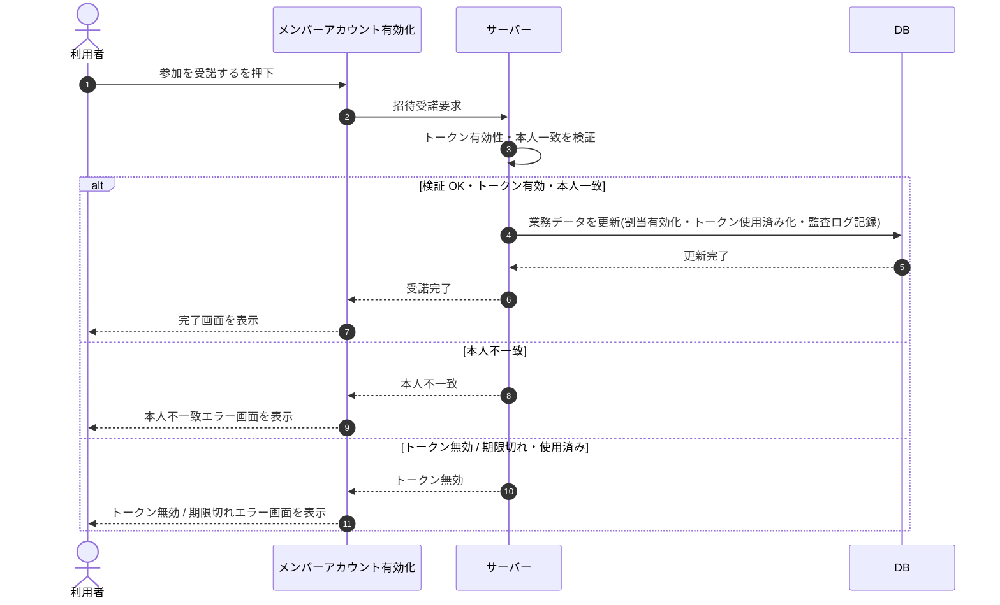

# SEQ-073: 「参加を受諾する」を押下

> **このページは、業務ユースケース UC-006（「参加を受諾する」を押下）のシーケンス図を定義します。**

| ID | 業務ユースケースID | イベント(画面ID EVT-NN) | テーブルID |
|----|----|----|----|
| SEQ-073 | [UC-006](../../01_requirements/04_business_usecases/UC-006.md#UC-006) | SCR-023 EVT-04 | [TBL-001](../02_backend/04_database/TBL-001.md#TBL-001) ・ [TBL-003](../02_backend/04_database/TBL-003.md#TBL-003) ・ [TBL-014](../02_backend/04_database/TBL-014.md#TBL-014) ・ [TBL-027](../02_backend/04_database/TBL-027.md#TBL-027) |

## 概要

招待された登録済みユーザー本人が招待内容を確認したうえで「参加を受諾する」を押下すると、サーバーが招待トークンの有効性(期限・使用済み)と招待先メールとログイン中ユーザーの一致(本人受諾)を再検証し、問題がなければ対象プロジェクトへの割当有効化・招待トークンの使用済み化・監査ログ記録を同一トランザクションで実行する。成功時は完了画面を表示し、失敗時は内容を確定しない。表示名・初回パスワード・規約同意の収集は行わない。

## シーケンス図

## 例外フロー

- 本人不一致: 招待先メールとログイン中ユーザーのメールが一致しない場合、本人不一致エラー画面を表示し、状態を確定しない。
- トークン無効 / 期限切れ / 使用済み: 招待トークンが期限切れ・使用済み・無効の場合、トークン無効 / 期限切れエラー画面を表示し、状態を確定しない。

## 詳細設計への移管候補

| 内容 | 移管先候補 | 理由 |
|---|---|---|
| 複数テーブル更新の同一トランザクション内の順序・ロールバック | 詳細設計 | 基本設計では 1 段に集約し、トランザクション内の実装順序は展開しない |

## 備考

- 本図は基本設計レベルの抽象度(ユーザー / 画面 / サーバー、システム起点は外部システム・スケジューラ・バッチを加える)で記述する。DB 操作は DB アクターへのメッセージで表し、テーブル別 CRUD は本図に書かず 関連テーブル 欄で示す。
- 図の出典は業務ユースケース [UC-006](../../01_requirements/04_business_usecases/UC-006.md#UC-006)。画面イベントとの対応は UC-006 を参照。
