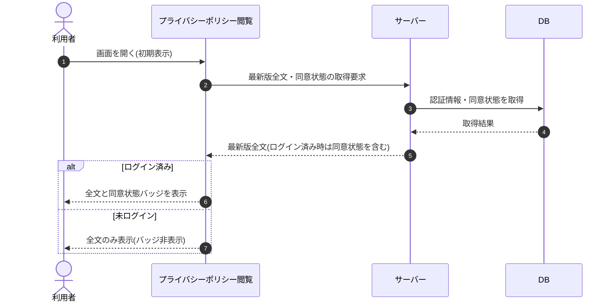

# SEQ-075: 初期表示

> **このページは、業務ユースケース UC-012（初期表示）のシーケンス図を定義します。**

| ID | 業務ユースケースID | イベント(画面ID EVT-NN) | テーブルID |
|----|----|----|----|
| SEQ-075 | [UC-012](../../01_requirements/04_business_usecases/UC-012.md#UC-012) | SCR-025 EVT-01 | [TBL-012](../02_backend/04_database/TBL-012.md#TBL-012) ・ [TBL-024](../02_backend/04_database/TBL-024.md#TBL-024) |

## 概要

プライバシーポリシー閲覧画面を開いた利用者へ、最新版の全文を表示する。全文は公開取得([API-053](../02_backend/03_apis/API-053.md#API-053))で誰でも取得できる。アカウント利用者がログイン済みのときは、同じ取得要求で同意状態も併せて取得し同意状態バッジを表示し、未ログインのときは同意状態を取得せずバッジを非表示にする。

## シーケンス図

## 備考

- 本図は基本設計レベルの抽象度(ユーザー / 画面 / サーバー、システム起点は外部システム・スケジューラ・バッチを加える)で記述する。DB 操作は DB アクターへのメッセージで表し、テーブル別 CRUD は本図に書かず 関連テーブル 欄で示す。
- 図の出典は業務ユースケース [UC-012](../../01_requirements/04_business_usecases/UC-012.md#UC-012)。画面イベントとの対応は UC-012 を参照。
- 最新版全文の取得は公開取得 [API-053](../02_backend/03_apis/API-053.md#API-053) が担い、認証済みリクエスト時のみ同意状態を併せて返す。ログイン済み分岐の同意状態は [TBL-024](../02_backend/04_database/TBL-024.md#TBL-024)(T_TERMS_AGREE)を参照して算出する。
