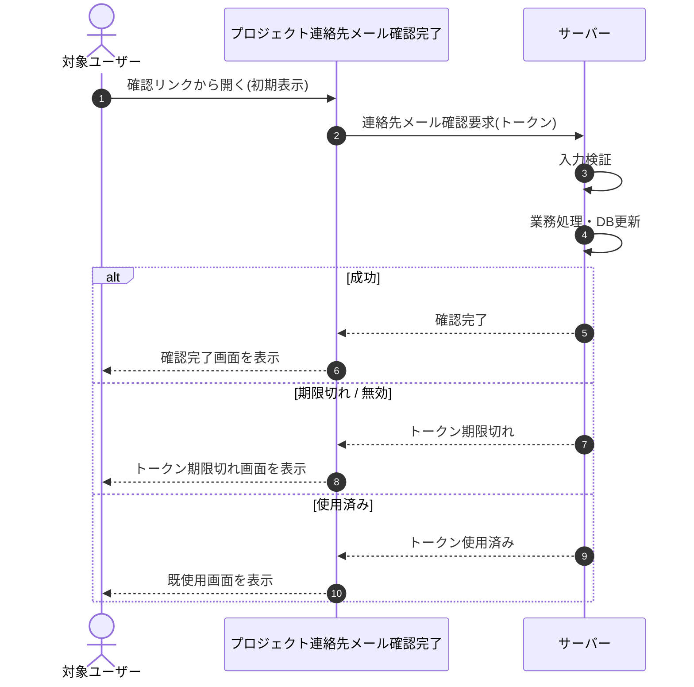

# SEQ-075: 初期表示

> **このページは、業務ユースケース UC-007（初期表示）のシーケンス図を定義します。**

## 項目

| 項目 | 内容 |
|---|---|
| SEQ ID | `SEQ-075` |
| 対応業務ユースケース | [UC-007](../../01_requirements/04_business_usecases/UC-007.md#UC-007) |
| 業務要件 (BR) | [BR-024](../../01_requirements/01_business_requirement/01_account-br.md#BR-024) |
| 機能要件 (FR) | [FR-043](../../01_requirements/02_functional_requirement/01_account-fr.md#FR-043) ・ [FR-044](../../01_requirements/02_functional_requirement/01_account-fr.md#FR-044) |
| 画面イベント (EVT) | [EVT-194](../01_frontend/02_screen_events/EVT-194.md#EVT-194) |
| 関連画面 | [SCR-024](../01_frontend/01_screens/SCR-024.md#SCR-024) |
| 関連 API | [API-009](../02_backend/03_apis/API-009.md#API-009) |
| 関連テーブル | [TBL-004](../02_backend/04_database/TBL-004.md#TBL-004) ・ [TBL-014](../02_backend/04_database/TBL-014.md#TBL-014) |
| エラー (ERR) | [ERR-008](../05_errors/ERR-008.md#ERR-008) ・ [ERR-009](../05_errors/ERR-009.md#ERR-009) ・ [ERR-010](../05_errors/ERR-010.md#ERR-010) |
| メッセージ (MSG) | — |

## 概要

連絡先メールの確認リンクから開くと、画面が確認トークンをサーバーへ送り検証・消費する。結果に応じて、確認完了 / トークン期限切れ / 既使用の状態画面を表示する。

## シーケンス図

## 例外フロー

- 期限切れ / 無効: トークン期限切れ画面を表示する（有効期限 24 時間）。
- 使用済み: 既使用画面を表示する。
- トークンが存在しない: トークンが見つからないため確認できない旨を表示する。

## 備考

- 本図は基本設計レベルの抽象度(ユーザー / 画面 / サーバー、システム起点は外部システム・スケジューラ・バッチを加える)で記述する。DB 操作はサーバー自己メッセージで表し、テーブル別 CRUD は本図に書かず 関連テーブル 欄で示す。
- 図の出典は業務ユースケース [UC-007](../../01_requirements/04_business_usecases/UC-007.md#UC-007)。画面イベントとの対応は UC-007 を参照。
