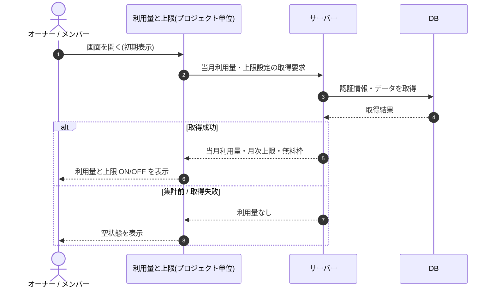

# SEQ-076: 初期表示

> **このページは、業務ユースケース UC-033（初期表示）のシーケンス図を定義します。**

| ID | 業務ユースケースID | イベント(画面ID EVT-NN) | テーブルID |
|----|----|----|----|
| SEQ-076 | [UC-033](../../01_requirements/04_business_usecases/UC-033.md#UC-033) | SCR-026 EVT-01 | [TBL-006](../02_backend/04_database/TBL-006.md#TBL-006) ・ [TBL-009](../02_backend/04_database/TBL-009.md#TBL-009) ・ [TBL-020](../02_backend/04_database/TBL-020.md#TBL-020) |

## 概要

利用量と上限画面を開いたとき、当月の質問数利用量と月次上限・無料枠の設定を取得して表示する。取得できた場合は利用量と上限 ON/OFF を反映し、集計前または取得失敗時は空状態を表示する。

## シーケンス図

## 備考

- 本図は基本設計レベルの抽象度(ユーザー / 画面 / サーバー、システム起点は外部システム・スケジューラ・バッチを加える)で記述する。DB 操作は DB アクターへのメッセージで表し、テーブル別 CRUD は本図に書かず 関連テーブル 欄で示す。
- 図の出典は業務ユースケース [UC-033](../../01_requirements/04_business_usecases/UC-033.md#UC-033)。画面イベントとの対応は UC-033 を参照。
