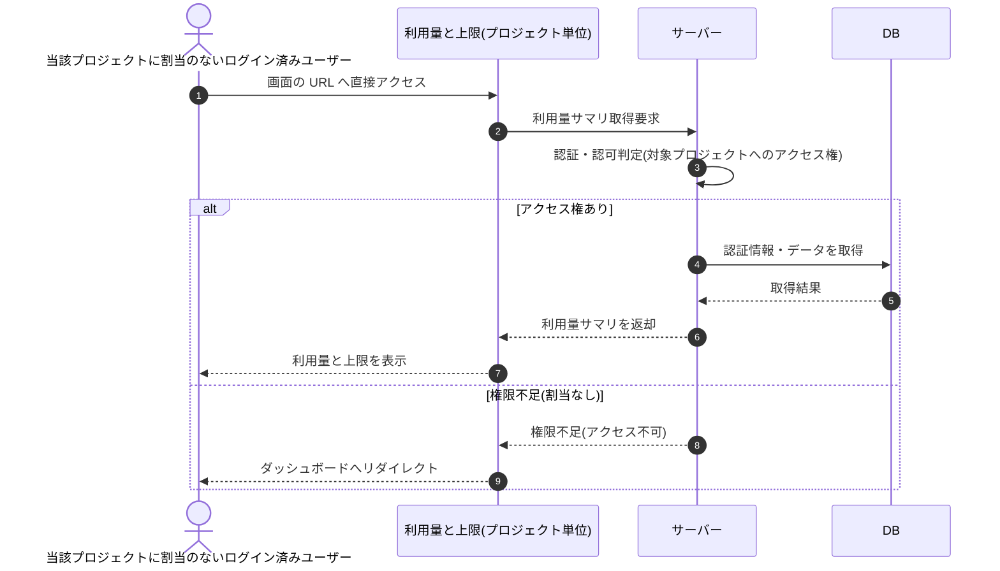

# SEQ-078: URL へ直接アクセス(権限不足)

> **このページは、業務ユースケース UC-048（URL へ直接アクセス(権限不足)）のシーケンス図を定義します。**

## 項目

| 項目 | 内容 |
|---|---|
| SEQ ID | `SEQ-078` |
| 対応業務ユースケース | [UC-048](../../01_requirements/04_business_usecases/UC-048.md#UC-048) |
| 業務要件 (BR) | [BR-101](../../01_requirements/01_business_requirement/06_security-br.md#BR-101) |
| 機能要件 (FR) | [FR-088](../../01_requirements/02_functional_requirement/03_usage-fr.md#FR-088) ・ [FR-089](../../01_requirements/02_functional_requirement/03_usage-fr.md#FR-089) |
| 画面イベント (EVT) | EVT-201 |
| 関連画面 | [SCR-026](../01_frontend/01_screens/SCR-026.md#SCR-026) |
| 関連 API | [API-041](../02_backend/03_apis/API-041.md#API-041) |
| 関連テーブル | [TBL-020](../02_backend/04_database/TBL-020.md#TBL-020) |
| エラー (ERR) | — |
| メッセージ (MSG) | — |

## 概要

当該プロジェクトへの割当がないログイン済みユーザーが利用量と上限画面の URL に直接アクセスした際、権限不足ガードにより 403 を返し、ダッシュボードへリダイレクトする。

## シーケンス図

## 例外フロー

- 当該プロジェクトへの割当がない場合、サーバーは認可判定でアクセス不可と判断し、画面はダッシュボードへリダイレクトする。

## 備考

- 本図は基本設計レベルの抽象度(ユーザー / 画面 / サーバー、システム起点は外部システム・スケジューラ・バッチを加える)で記述する。DB 操作は DB アクターへのメッセージで表し、テーブル別 CRUD は本図に書かず 関連テーブル 欄で示す。
- 図の出典は業務ユースケース [UC-048](../../01_requirements/04_business_usecases/UC-048.md#UC-048)。画面イベントとの対応は UC-048 を参照。
