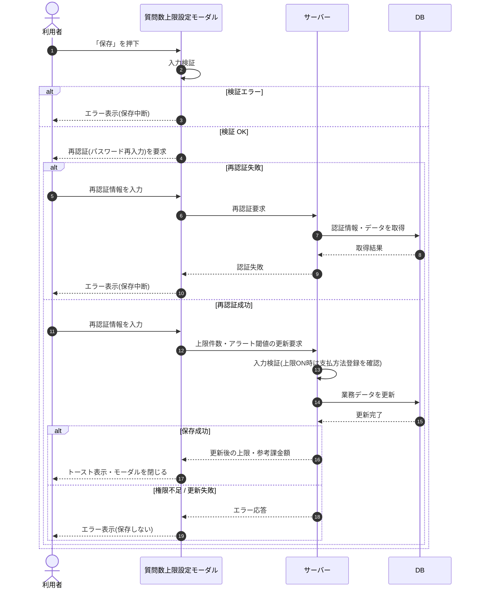

# SEQ-078: 「保存」を押下

> **このページは、業務ユースケース UC-034（「保存」を押下）のシーケンス図を定義します。**

| ID | 業務ユースケースID | イベント(画面ID EVT-NN) | テーブルID |
|----|----|----|----|
| SEQ-078 | [UC-034](../../01_requirements/04_business_usecases/UC-034.md#UC-034) | SCR-027 EVT-05 | [TBL-009](../02_backend/04_database/TBL-009.md#TBL-009) ・ [TBL-020](../02_backend/04_database/TBL-020.md#TBL-020) |

## 概要

質問数上限設定モーダルで利用者が「保存」を押下すると、入力検証と再認証を経て上限件数・アラート閾値を保存し、トーストを表示してモーダルを閉じる。検証失敗・再認証失敗・権限不足時は保存せずエラーを表示する。

## シーケンス図

## 例外フロー

- 入力検証エラー時は保存せずモーダル上にエラーを表示する。
- 再認証失敗時は保存を中断しエラーを表示する（[ERR-005](../05_errors/ERR-005.md#ERR-005)）。
- 当該プロジェクトに割当のないユーザーは権限不足として保存できない([ERR-030](../05_errors/ERR-030.md#ERR-030))。
- 未サポート項目を指定した要求は受理されない([ERR-029](../05_errors/ERR-029.md#ERR-029))。
- 上限をオンにする際に支払方法が未登録の場合、保存せず支払方法登録を促すエラーを表示する([ERR-038](../05_errors/ERR-038.md#ERR-038))。

## 備考

- 本図は基本設計レベルの抽象度(ユーザー / 画面 / サーバー、システム起点は外部システム・スケジューラ・バッチを加える)で記述する。DB 操作は DB アクターへのメッセージで表し、テーブル別 CRUD は本図に書かず 関連テーブル 欄で示す。
- 図の出典は業務ユースケース [UC-034](../../01_requirements/04_business_usecases/UC-034.md#UC-034)。画面イベントとの対応は UC-034 を参照。
