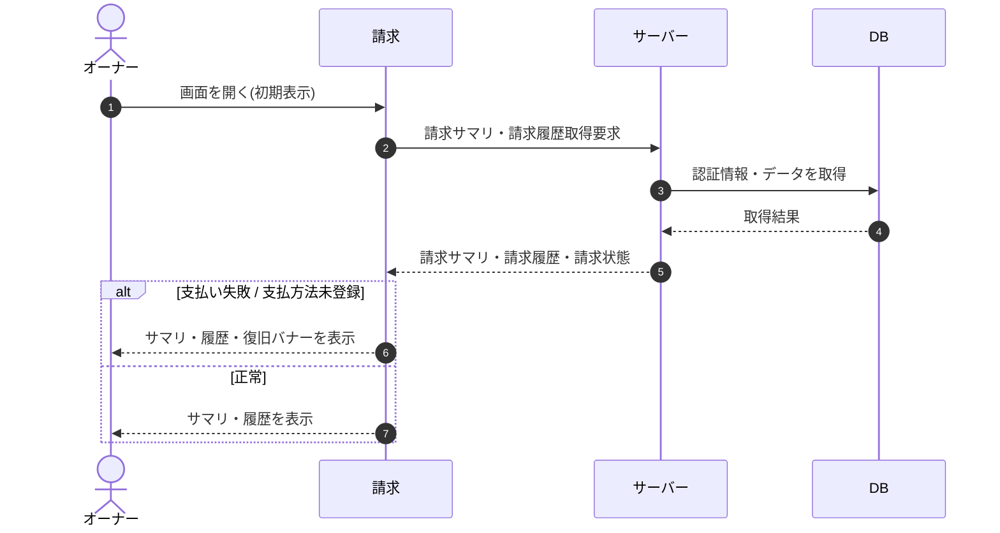

# SEQ-079: 初期表示

> **このページは、業務ユースケース UC-036（初期表示）のシーケンス図を定義します。**

| ID | 業務ユースケースID | イベント(画面ID EVT-NN) | テーブルID |
|----|----|----|----|
| SEQ-079 | [UC-036](../../01_requirements/04_business_usecases/UC-036.md#UC-036) | SCR-028 EVT-01 | [TBL-002](../02_backend/04_database/TBL-002.md#TBL-002) ・ [TBL-018](../02_backend/04_database/TBL-018.md#TBL-018) ・ [TBL-019](../02_backend/04_database/TBL-019.md#TBL-019) ・ [TBL-020](../02_backend/04_database/TBL-020.md#TBL-020) |

## 概要

オーナーが請求画面を開いたときに、当月請求見込み・次回請求日・請求状態・プロジェクト別内訳・支払方法と請求履歴を取得して表示する。支払い失敗または支払方法未登録のときは復旧バナーを併せて表示する。

## シーケンス図

## 備考

- 本図は基本設計レベルの抽象度(ユーザー / 画面 / サーバー、システム起点は外部システム・スケジューラ・バッチを加える)で記述する。DB 操作は DB アクターへのメッセージで表し、テーブル別 CRUD は本図に書かず 関連テーブル 欄で示す。
- 図の出典は業務ユースケース [UC-036](../../01_requirements/04_business_usecases/UC-036.md#UC-036)。画面イベントとの対応は UC-036 を参照。
