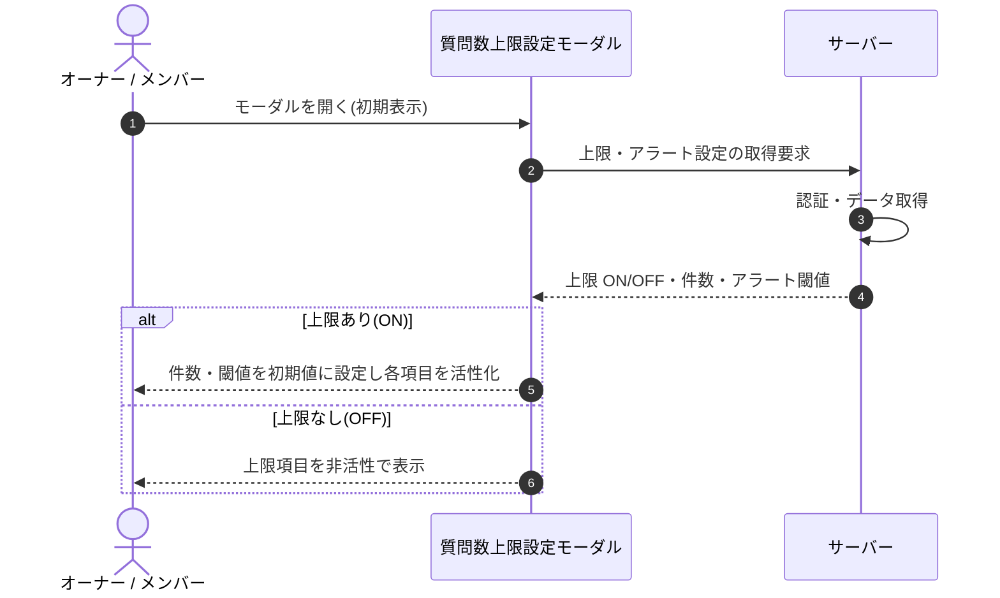

<!-- portal-top -->
[設計ポータル](../../README.md) ／ [基本設計](../index.md) ／ [シーケンス設計](index.md) ／ **SEQ-079: 初期表示**
<!-- /portal-top -->

# SEQ-079: 初期表示

> **このページは、業務ユースケース UC-035（初期表示）のシーケンス図を定義します。**

*版数 v2.0 ・ 更新 2026-06-23 ・ ステータス ドラフト*

## 項目

| 項目 | 内容 |
|---|---|
| SEQ ID | `SEQ-079` |
| 対応業務ユースケース | [UC-035](../../01_requirements/04_business_usecases/UC-035.md#UC-035) |
| 業務要件 (BR) | 要確認 |
| 機能要件 (FR) | [FR-088](../../01_requirements/02_FunctionalRequirement/03_usage-fr.md#FR-088) |
| 画面イベント (EVT) | [EVT-202](../01_frontend/02_screen_events/EVT-202.md#EVT-202) |
| 関連画面 | [SCR-027](../01_frontend/01_screens/SCR-027.md#SCR-027) |
| 関連 API | [API-046](../02_backend/03_apis/API-046.md#API-046) |
| 関連テーブル | [TBL-009](../02_backend/04_database/TBL-009.md#TBL-009) |
| エラー (ERR) | — |
| メッセージ (MSG) | 要確認 |

## 概要

質問数上限設定モーダルを開いた際に、当該プロジェクトの上限 ON/OFF・件数・アラート閾値を取得し、各項目の初期値・活性状態へ反映する。

## シーケンス図

## 備考

- 本図は基本設計レベルの抽象度(ユーザー / 画面 / サーバー、システム起点は外部システム・スケジューラ・バッチを加える)で記述する。DB 操作はサーバー自己メッセージで表し、テーブル別 CRUD は本図に書かず 関連テーブル 欄で示す。
- 図の出典は業務ユースケース [UC-035](../../01_requirements/04_business_usecases/UC-035.md#UC-035)。画面イベントとの対応は UC-035 を参照。

---

<!-- portal-bottom -->
[← シーケンス設計](index.md) ・ [基本設計](../index.md) ・ [↑ 設計ポータル](../../README.md)
<!-- /portal-bottom -->
