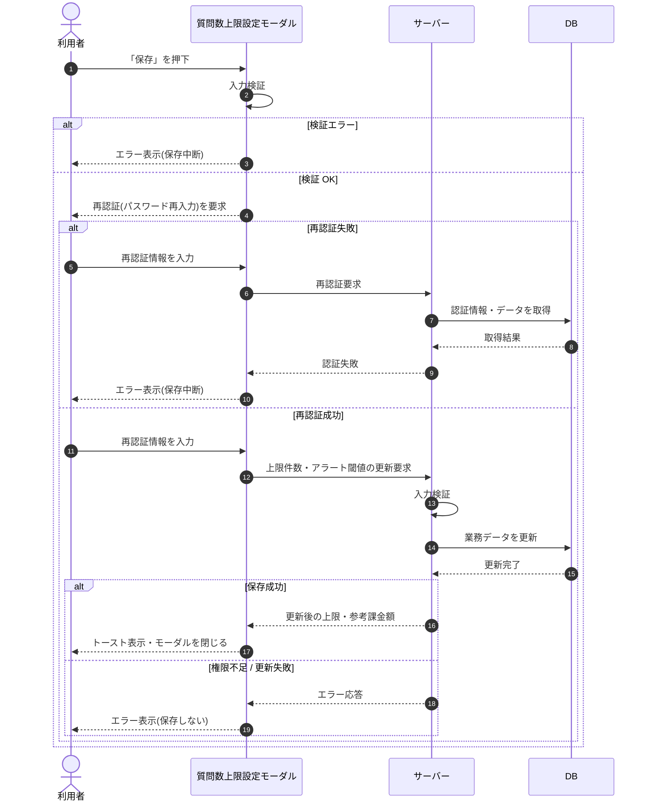

# SEQ-080: 「保存」を押下

> **このページは、業務ユースケース UC-035（「保存」を押下）のシーケンス図を定義します。**

## 項目

| 項目 | 内容 |
|---|---|
| SEQ ID | `SEQ-080` |
| トレーサビリティID | [TR-035](../00_traceability/index.md#TR-035) |
| 画面イベント (EVT) | EVT-178 |
| 関連画面 | [SCR-027](../01_frontend/01_screens/SCR-027.md#SCR-027) |
| 関連 API | [API-047](../02_backend/03_apis/API-047.md#API-047) |
| 関連テーブル | [TBL-009](../02_backend/04_database/TBL-009.md#TBL-009) |
| エラー (ERR) | [ERR-007](../05_errors/ERR-007.md#ERR-007) ・ [ERR-031](../05_errors/ERR-031.md#ERR-031) ・ [ERR-032](../05_errors/ERR-032.md#ERR-032) |
| メッセージ (MSG) | — |

## 概要

質問数上限設定モーダルで利用者が「保存」を押下すると、入力検証と再認証を経て上限件数・アラート閾値を保存し、トーストを表示してモーダルを閉じる。検証失敗・再認証失敗・権限不足時は保存せずエラーを表示する。

## シーケンス図

## 例外フロー

- 入力検証エラー時は保存せずモーダル上にエラーを表示する。
- 再認証失敗時は保存を中断しエラーを表示する（[ERR-007](../05_errors/ERR-007.md#ERR-007)）。
- 当該プロジェクトに割当のないユーザーは権限不足として保存できない([ERR-032](../05_errors/ERR-032.md#ERR-032))。
- 未サポート項目を指定した要求は受理されない([ERR-031](../05_errors/ERR-031.md#ERR-031))。

## 備考

- 本図は基本設計レベルの抽象度(ユーザー / 画面 / サーバー、システム起点は外部システム・スケジューラ・バッチを加える)で記述する。DB 操作は DB アクターへのメッセージで表し、テーブル別 CRUD は本図に書かず 関連テーブル 欄で示す。
- 図の出典は業務ユースケース [UC-035](../../01_requirements/04_business_usecases/UC-035.md#UC-035)。画面イベントとの対応は UC-035 を参照。
