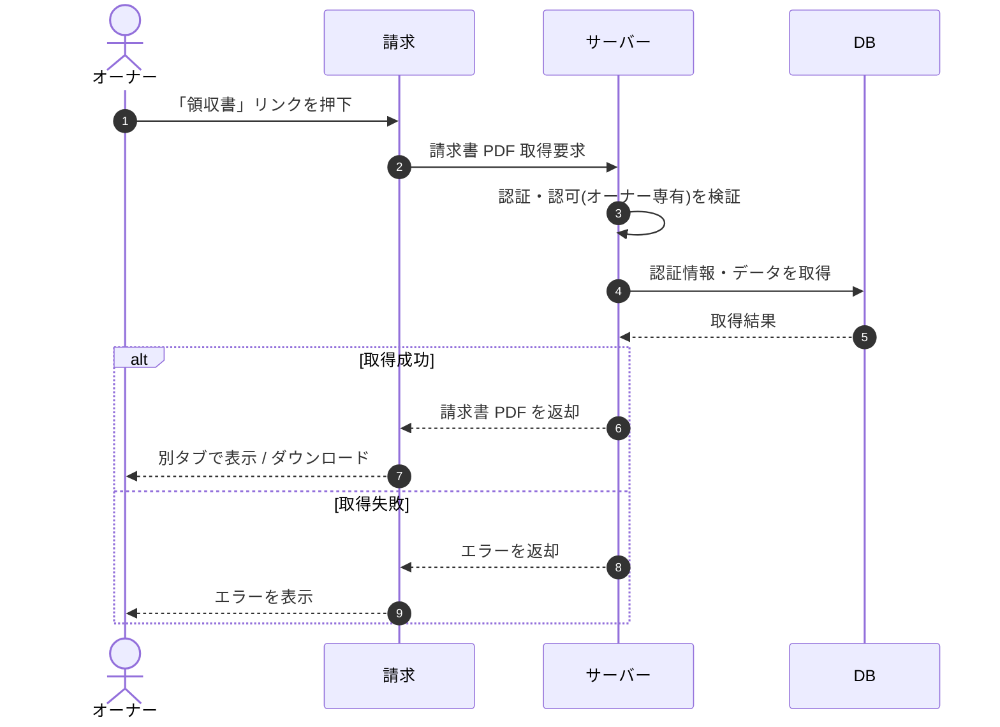

# SEQ-081: 「領収書」リンクを押下

> **このページは、業務ユースケース UC-036（「領収書」リンクを押下）のシーケンス図を定義します。**

| ID | 業務ユースケースID | イベント(画面ID EVT-NN) | テーブルID |
|----|----|----|----|
| SEQ-081 | [UC-036](../../01_requirements/04_business_usecases/UC-036.md#UC-036) | SCR-028 EVT-03 | [TBL-002](../02_backend/04_database/TBL-002.md#TBL-002) ・ [TBL-018](../02_backend/04_database/TBL-018.md#TBL-018) ・ [TBL-019](../02_backend/04_database/TBL-019.md#TBL-019) ・ [TBL-020](../02_backend/04_database/TBL-020.md#TBL-020) |

## 概要

オーナーが請求画面の請求履歴から「領収書」リンクを押下すると、サーバーが該当請求行の請求書 PDF を取得し、別タブで表示またはダウンロードする。

## シーケンス図

## 例外フロー

- 認可エラー: オーナー以外が操作した場合、サーバーは権限不足として拒否し、画面はエラーを表示する。
- 取得失敗: 該当請求書が存在しない / 署名 URL の発行に失敗した場合、画面はエラーを表示する。

## 備考

- 本図は基本設計レベルの抽象度(ユーザー / 画面 / サーバー、システム起点は外部システム・スケジューラ・バッチを加える)で記述する。DB 操作は DB アクターへのメッセージで表し、テーブル別 CRUD は本図に書かず 関連テーブル 欄で示す。
- 図の出典は業務ユースケース [UC-036](../../01_requirements/04_business_usecases/UC-036.md#UC-036)。画面イベントとの対応は UC-036 を参照。
