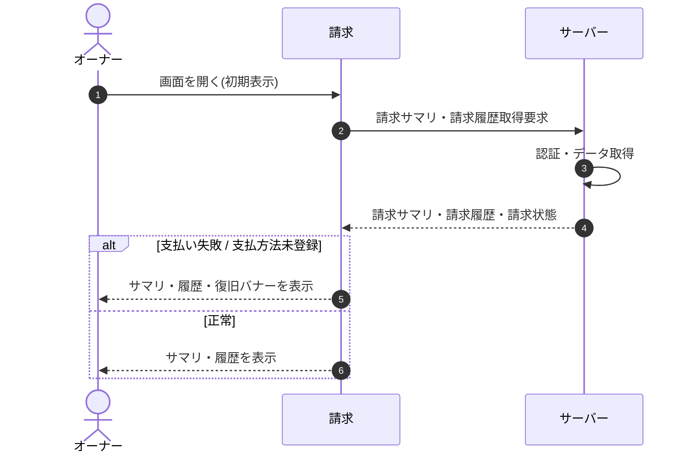

<!-- portal-top -->
[設計ポータル](../../README.md) ／ [基本設計](../index.md) ／ [シーケンス設計](index.md) ／ **SEQ-081: 初期表示**
<!-- /portal-top -->

# SEQ-081: 初期表示

> **このページは、業務ユースケース UC-037（初期表示）のシーケンス図を定義します。**

*版数 v2.0 ・ 更新 2026-06-23 ・ ステータス ドラフト*

## 項目

| 項目 | 内容 |
|---|---|
| SEQ ID | `SEQ-081` |
| 対応業務ユースケース | [UC-037](../../01_requirements/04_business_usecases/UC-037.md#UC-037) |
| 業務要件 (BR) | [BR-066](../../01_requirements/01_BusinessRequirement/03_usage-br.md#BR-066) |
| 機能要件 (FR) | [FR-089](../../01_requirements/02_FunctionalRequirement/03_usage-fr.md#FR-089) |
| 画面イベント (EVT) | [EVT-208](../01_frontend/02_screen_events/EVT-208.md#EVT-208) |
| 関連画面 | [SCR-028](../01_frontend/01_screens/SCR-028.md#SCR-028) |
| 関連 API | [API-043](../02_backend/03_apis/API-043.md#API-043) ・ [API-044](../02_backend/03_apis/API-044.md#API-044) |
| 関連テーブル | [TBL-018](../02_backend/04_database/TBL-018.md#TBL-018) ・ [TBL-019](../02_backend/04_database/TBL-019.md#TBL-019) ・ [TBL-020](../02_backend/04_database/TBL-020.md#TBL-020) |
| エラー (ERR) | — |
| メッセージ (MSG) | — |

## 概要

オーナーが請求画面を開いたときに、当月請求見込み・次回請求日・請求状態・プロジェクト別内訳・支払方法と請求履歴を取得して表示する。支払い失敗または支払方法未登録のときは復旧バナーを併せて表示する。

## シーケンス図

## 備考

- 本図は基本設計レベルの抽象度(ユーザー / 画面 / サーバー、システム起点は外部システム・スケジューラ・バッチを加える)で記述する。DB 操作はサーバー自己メッセージで表し、テーブル別 CRUD は本図に書かず 関連テーブル 欄で示す。
- 図の出典は業務ユースケース [UC-037](../../01_requirements/04_business_usecases/UC-037.md#UC-037)。画面イベントとの対応は UC-037 を参照。

---

<!-- portal-bottom -->
[← シーケンス設計](index.md) ・ [基本設計](../index.md) ・ [↑ 設計ポータル](../../README.md)
<!-- /portal-bottom -->
