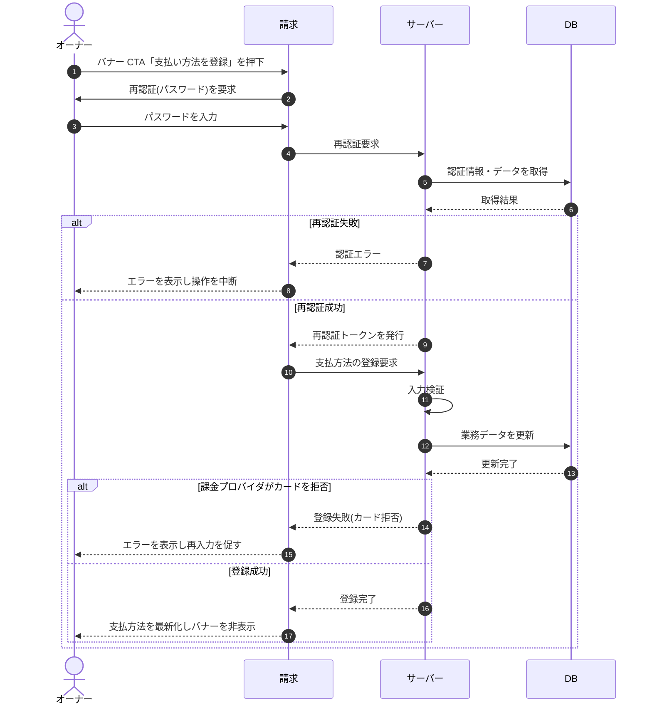

# SEQ-082: 「支払い方法を登録」を押下(バナー CTA)

> **このページは、業務ユースケース UC-037（「支払い方法を登録」を押下(バナー CTA)）のシーケンス図を定義します。**

| ID | 業務ユースケースID | イベント(画面ID EVT-NN) | テーブルID |
|----|----|----|----|
| SEQ-082 | [UC-037](../../01_requirements/04_business_usecases/UC-037.md#UC-037) | SCR-028 EVT-06 | [TBL-002](../02_backend/04_database/TBL-002.md#TBL-002) ・ [TBL-003](../02_backend/04_database/TBL-003.md#TBL-003) ・ [TBL-014](../02_backend/04_database/TBL-014.md#TBL-014) ・ [TBL-018](../02_backend/04_database/TBL-018.md#TBL-018) ・ [TBL-019](../02_backend/04_database/TBL-019.md#TBL-019) ・ [TBL-020](../02_backend/04_database/TBL-020.md#TBL-020) |

## 概要

オーナーが支払失敗・支払方法未登録の復旧バナーの CTA「支払い方法を登録」を押下し、再認証を経て支払方法を登録する。成功時は支払方法表示を最新化しバナーを非表示にし、失敗時は操作を中断する。

## シーケンス図

## 例外フロー

- 再認証に失敗した場合は認証エラーを表示し操作を中断する。
- 課金プロバイダが支払方法(カード)を拒否した場合は登録失敗を表示し再入力を促す。
- 入力値の検証エラー時は該当項目のエラーを表示する。
- オーナー以外による操作は認可エラーとして拒否する。

## 備考

- 本図は基本設計レベルの抽象度(ユーザー / 画面 / サーバー、システム起点は外部システム・スケジューラ・バッチを加える)で記述する。DB 操作は DB アクターへのメッセージで表し、テーブル別 CRUD は本図に書かず 関連テーブル 欄で示す。
- 図の出典は業務ユースケース [UC-037](../../01_requirements/04_business_usecases/UC-037.md#UC-037)。画面イベントとの対応は UC-037 を参照。
