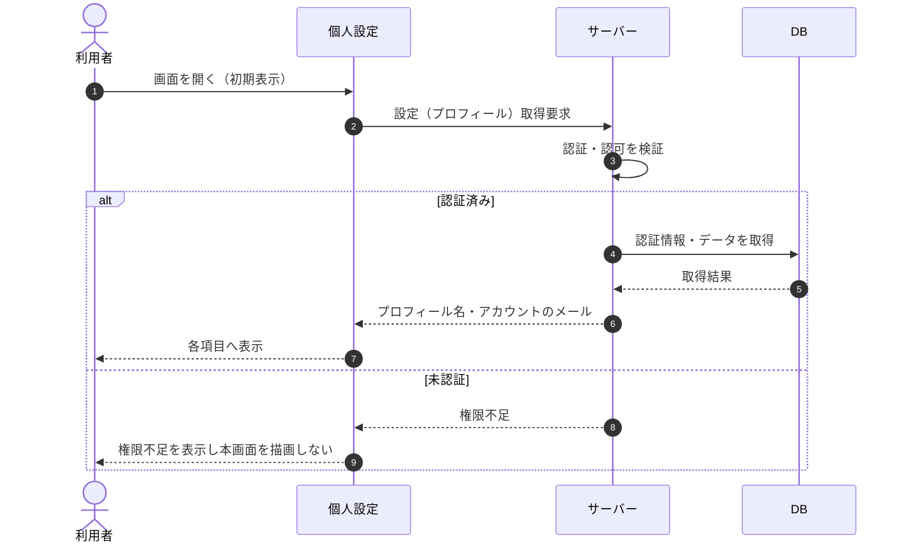

# SEQ-083: 初期表示

> **このページは、業務ユースケース UC-009（初期表示）のシーケンス図を定義します。**

| ID | 業務ユースケースID | イベント(画面ID EVT-NN) | テーブルID |
|----|----|----|----|
| SEQ-083 | [UC-009](../../01_requirements/04_business_usecases/UC-009.md#UC-009) | SCR-022 EVT-01 | [TBL-001](../02_backend/04_database/TBL-001.md#TBL-001) ・ [TBL-002](../02_backend/04_database/TBL-002.md#TBL-002) ・ [TBL-003](../02_backend/04_database/TBL-003.md#TBL-003) ・ [TBL-014](../02_backend/04_database/TBL-014.md#TBL-014) |

## 概要

利用者が設定画面を開くと、サーバーが認可を検証したうえでプロフィール名・アカウントのメールを取得し、各項目へ表示する。

## シーケンス図

## 例外フロー

- 未認証の利用者が本画面へアクセスした場合は権限不足を表示し、本画面を描画しない。

## 備考

- 本図は基本設計レベルの抽象度(ユーザー / 画面 / サーバー、システム起点は外部システム・スケジューラ・バッチを加える)で記述する。DB 操作は DB アクターへのメッセージで表し、テーブル別 CRUD は本図に書かず 関連テーブル 欄で示す。
- 図の出典は業務ユースケース [UC-009](../../01_requirements/04_business_usecases/UC-009.md#UC-009)。画面イベントとの対応は UC-009 を参照。
