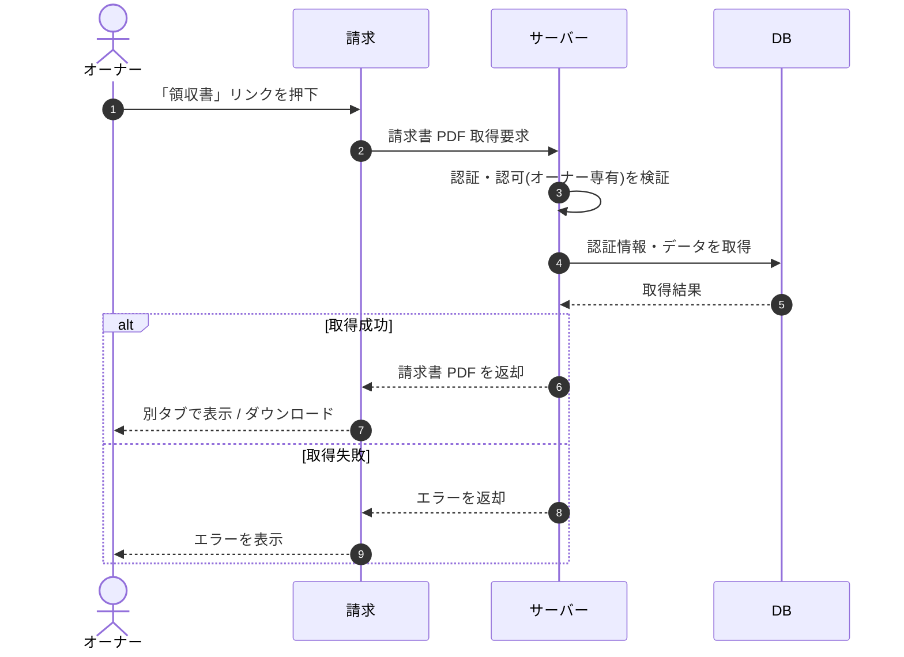

# SEQ-083: 「領収書」リンクを押下

> **このページは、業務ユースケース UC-037（「領収書」リンクを押下）のシーケンス図を定義します。**

## 項目

| 項目 | 内容 |
|---|---|
| SEQ ID | `SEQ-083` |
| トレーサビリティID | [TR-037](../00_traceability/index.md#TR-037) |
| 画面イベント (EVT) | EVT-187 |
| 関連画面 | [SCR-028](../01_frontend/01_screens/SCR-028.md#SCR-028) |
| 関連 API | [API-044](../02_backend/03_apis/API-044.md#API-044) |
| 関連テーブル | [TBL-019](../02_backend/04_database/TBL-019.md#TBL-019) |
| エラー (ERR) | — |
| メッセージ (MSG) | — |

## 概要

オーナーが請求画面の請求履歴から「領収書」リンクを押下すると、サーバーが該当請求行の請求書 PDF を取得し、別タブで表示またはダウンロードする。

## シーケンス図

## 例外フロー

- 認可エラー: オーナー以外が操作した場合、サーバーは権限不足として拒否し、画面はエラーを表示する。
- 取得失敗: 該当請求書が存在しない / 署名 URL の発行に失敗した場合、画面はエラーを表示する。

## 備考

- 本図は基本設計レベルの抽象度(ユーザー / 画面 / サーバー、システム起点は外部システム・スケジューラ・バッチを加える)で記述する。DB 操作は DB アクターへのメッセージで表し、テーブル別 CRUD は本図に書かず 関連テーブル 欄で示す。
- 図の出典は業務ユースケース [UC-037](../../01_requirements/04_business_usecases/UC-037.md#UC-037)。画面イベントとの対応は UC-037 を参照。
