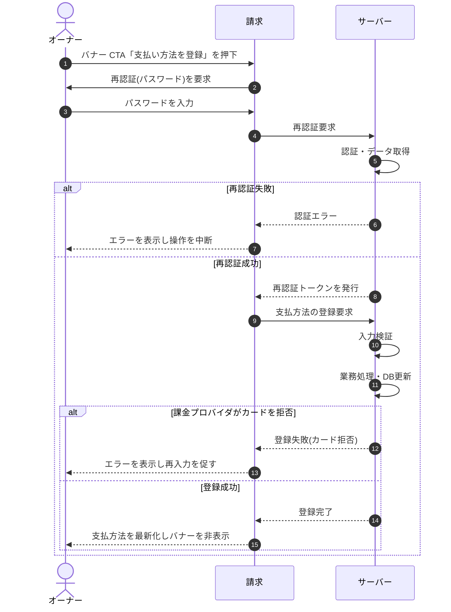

<!-- portal-top -->
[設計ポータル](../../README.md) ／ [基本設計](../index.md) ／ [シーケンス設計](index.md) ／ **SEQ-084: 「支払い方法を登録」を押下(バナー CTA)**
<!-- /portal-top -->

# SEQ-084: 「支払い方法を登録」を押下(バナー CTA)

> **このページは、業務ユースケース UC-038（「支払い方法を登録」を押下(バナー CTA)）のシーケンス図を定義します。**

*版数 v2.0 ・ 更新 2026-06-23 ・ ステータス ドラフト*

## 項目

| 項目 | 内容 |
|---|---|
| SEQ ID | `SEQ-084` |
| 対応業務ユースケース | [UC-038](../../01_requirements/04_business_usecases/UC-038.md#UC-038) |
| 業務要件 (BR) | [BR-064](../../01_requirements/01_business_requirement/03_usage-br.md#BR-064) ・ [BR-065](../../01_requirements/01_business_requirement/03_usage-br.md#BR-065) |
| 機能要件 (FR) | [FR-090](../../01_requirements/02_functional_requirement/03_usage-fr.md#FR-090) |
| 画面イベント (EVT) | [EVT-213](../01_frontend/02_screen_events/EVT-213.md#EVT-213) |
| 関連画面 | [SCR-028](../01_frontend/01_screens/SCR-028.md#SCR-028) |
| 関連 API | [API-005](../02_backend/03_apis/API-005.md#API-005) ・ [API-045](../02_backend/03_apis/API-045.md#API-045) |
| 関連テーブル | [TBL-018](../02_backend/04_database/TBL-018.md#TBL-018) |
| エラー (ERR) | [ERR-001](../05_errors/ERR-001.md#ERR-001) ・ [ERR-007](../05_errors/ERR-007.md#ERR-007) ・ [ERR-017](../05_errors/ERR-017.md#ERR-017) ・ [ERR-030](../05_errors/ERR-030.md#ERR-030) |
| メッセージ (MSG) | — |

## 概要

オーナーが支払失敗・支払方法未登録の復旧バナーの CTA「支払い方法を登録」を押下し、再認証を経て支払方法を登録する。成功時は支払方法表示を最新化しバナーを非表示にし、失敗時は操作を中断する。

## シーケンス図

## 例外フロー

- 再認証に失敗した場合は認証エラーを表示し操作を中断する。
- 課金プロバイダが支払方法(カード)を拒否した場合は登録失敗を表示し再入力を促す。
- 入力値の検証エラー時は該当項目のエラーを表示する。
- オーナー以外による操作は認可エラーとして拒否する。

## 備考

- 本図は基本設計レベルの抽象度(ユーザー / 画面 / サーバー、システム起点は外部システム・スケジューラ・バッチを加える)で記述する。DB 操作はサーバー自己メッセージで表し、テーブル別 CRUD は本図に書かず 関連テーブル 欄で示す。
- 図の出典は業務ユースケース [UC-038](../../01_requirements/04_business_usecases/UC-038.md#UC-038)。画面イベントとの対応は UC-038 を参照。

---

<!-- portal-bottom -->
[← シーケンス設計](index.md) ・ [基本設計](../index.md) ・ [↑ 設計ポータル](../../README.md)
<!-- /portal-bottom -->
