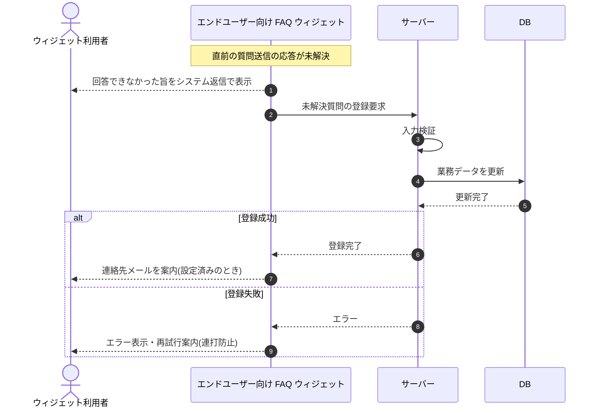

# SEQ-086: AI 回答(未解決)を受信

> **このページは、業務ユースケース UC-042（AI 回答(未解決)を受信）のシーケンス図を定義します。**

| ID | 業務ユースケースID | イベント(画面ID EVT-NN) | テーブルID |
|----|----|----|----|
| SEQ-086 | [UC-042](../../01_requirements/04_business_usecases/UC-042.md#UC-042) | SCR-030 EVT-05 | [TBL-002](../02_backend/04_database/TBL-002.md#TBL-002) ・ [TBL-004](../02_backend/04_database/TBL-004.md#TBL-004) ・ [TBL-005](../02_backend/04_database/TBL-005.md#TBL-005) ・ [TBL-006](../02_backend/04_database/TBL-006.md#TBL-006) ・ [TBL-017](../02_backend/04_database/TBL-017.md#TBL-017) ・ [TBL-020](../02_backend/04_database/TBL-020.md#TBL-020) ・ [TBL-025](../02_backend/04_database/TBL-025.md#TBL-025) ・ [TBL-015](../02_backend/04_database/TBL-015.md#TBL-015) |

## 概要

質問送信の応答が未解決のとき、回答できなかった旨をシステム返信として表示し、質問ログと未解決質問を登録する。連絡先メール設定済みのときは連絡先メールを案内表示し、別の質問の入力・送信は引き続き可能とする。

## シーケンス図

## 例外フロー

- 未解決質問の登録に失敗した場合は、ウィジェットにエラーを表示し再試行を案内する(連打防止)。

## 備考

- 本図は基本設計レベルの抽象度(ユーザー / 画面 / サーバー、システム起点は外部システム・スケジューラ・バッチを加える)で記述する。DB 操作は DB アクターへのメッセージで表し、テーブル別 CRUD は本図に書かず 関連テーブル 欄で示す。
- 図の出典は業務ユースケース [UC-042](../../01_requirements/04_business_usecases/UC-042.md#UC-042)。画面イベントとの対応は UC-042 を参照。
