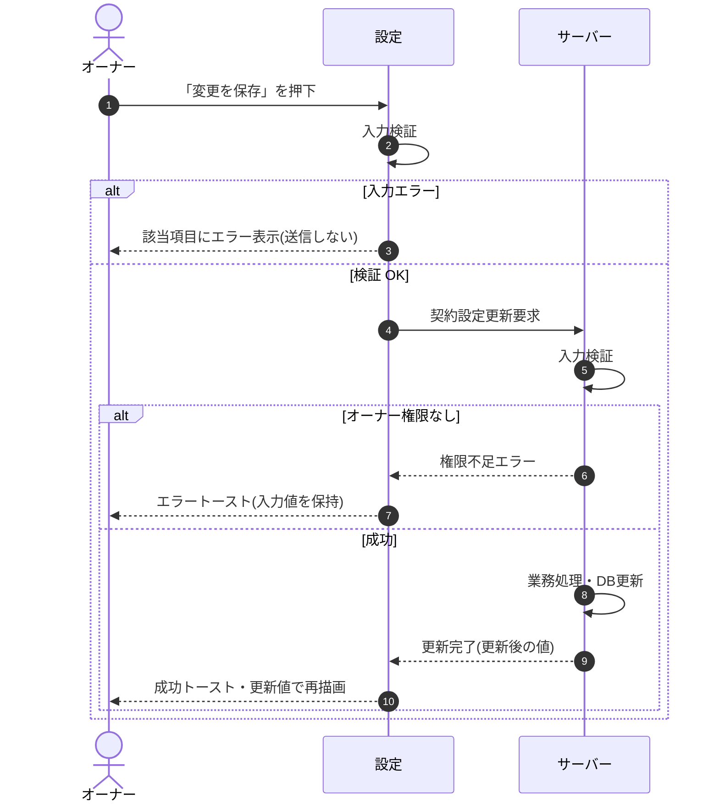

# SEQ-086: 「変更を保存」を押下

> **このページは、業務ユースケース UC-022（「変更を保存」を押下）のシーケンス図を定義します。**

*版数 v2.0 ・ 更新 2026-06-23 ・ ステータス ドラフト*

## 項目

| 項目 | 内容 |
|---|---|
| SEQ ID | `SEQ-086` |
| 対応業務ユースケース | [UC-022](../../01_requirements/04_business_usecases/UC-022.md#UC-022) |
| 業務要件 (BR) | [BR-009](../../01_requirements/01_business_requirement/01_account-br.md#BR-009) ・ [BR-017](../../01_requirements/01_business_requirement/01_account-br.md#BR-017) ・ [BR-144](../../01_requirements/01_business_requirement/01_account-br.md#BR-144) |
| 機能要件 (FR) | [FR-009](../../01_requirements/02_functional_requirement/01_account-fr.md#FR-009) |
| 画面イベント (EVT) | [EVT-217](../01_frontend/02_screen_events/EVT-217.md#EVT-217) |
| 関連画面 | [SCR-029](../01_frontend/01_screens/SCR-029.md#SCR-029) |
| 関連 API | [API-015](../02_backend/03_apis/API-015.md#API-015) |
| 関連テーブル | [TBL-002](../02_backend/04_database/TBL-002.md#TBL-002) |
| エラー (ERR) | [ERR-001](../05_errors/ERR-001.md#ERR-001) ・ [ERR-017](../05_errors/ERR-017.md#ERR-017) |
| メッセージ (MSG) | — |

## 概要

オーナーが設定画面で契約レベルの設定情報(連絡先メール・タイムゾーン)を更新する。成功時は更新後の値で再描画し、失敗時は入力値を保持してエラーを表示する。

## シーケンス図

## 例外フロー

- 入力値(メール形式・タイムゾーン識別子)が不正な場合は、該当項目にエラーを表示して送信しない([ERR-001](../05_errors/ERR-001.md#ERR-001))。
- オーナー以外の利用者が操作した場合は権限不足エラーとなり、入力値を保持してエラートーストを表示する([ERR-017](../05_errors/ERR-017.md#ERR-017))。

## 備考

- 本図は基本設計レベルの抽象度(ユーザー / 画面 / サーバー、システム起点は外部システム・スケジューラ・バッチを加える)で記述する。DB 操作はサーバー自己メッセージで表し、テーブル別 CRUD は本図に書かず 関連テーブル 欄で示す。
- 図の出典は業務ユースケース [UC-022](../../01_requirements/04_business_usecases/UC-022.md#UC-022)。画面イベントとの対応は UC-022 を参照。
