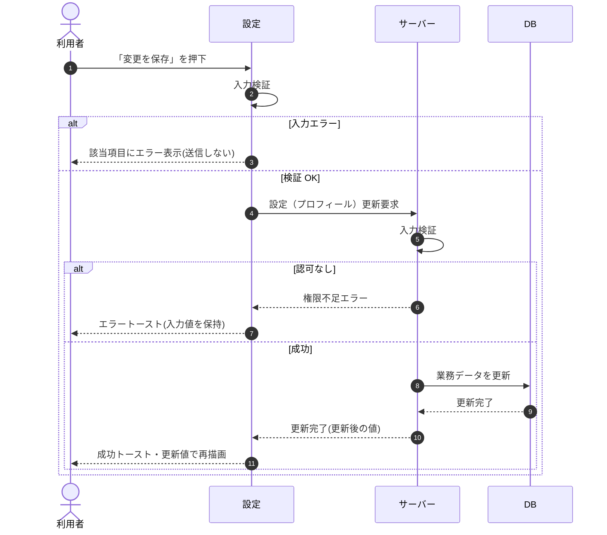

# SEQ-086: 「変更を保存」を押下

> **このページは、業務ユースケース UC-022（「変更を保存」を押下）のシーケンス図を定義します。**

## 項目

| 項目 | 内容 |
|---|---|
| SEQ ID | `SEQ-086` |
| トレーサビリティID | [TR-022](../00_traceability/index.md#TR-022) |
| 画面イベント (EVT) | EVT-192 |
| 関連画面 | [SCR-029](../01_frontend/01_screens/SCR-029.md#SCR-029) |
| 関連 API | [API-015](../02_backend/03_apis/API-015.md#API-015) |
| 関連テーブル | [TBL-002](../02_backend/04_database/TBL-002.md#TBL-002) |
| エラー (ERR) | [ERR-001](../05_errors/ERR-001.md#ERR-001) ・ [ERR-015](../05_errors/ERR-015.md#ERR-015) |
| メッセージ (MSG) | — |

## 概要

利用者が設定画面でプロフィール名を更新する。成功時は更新後の値で再描画し、失敗時は入力値を保持してエラーを表示する。

## シーケンス図

## 例外フロー

- 入力値(プロフィール名の文字数等)が不正な場合は、該当項目にエラーを表示して送信しない([ERR-001](../05_errors/ERR-001.md#ERR-001))。
- 認可がない場合は権限不足エラーとなり、入力値を保持してエラートーストを表示する([ERR-015](../05_errors/ERR-015.md#ERR-015))。

## 備考

- 本図は基本設計レベルの抽象度(ユーザー / 画面 / サーバー、システム起点は外部システム・スケジューラ・バッチを加える)で記述する。DB 操作は DB アクターへのメッセージで表し、テーブル別 CRUD は本図に書かず 関連テーブル 欄で示す。
- 図の出典は業務ユースケース [UC-022](../../01_requirements/04_business_usecases/UC-022.md#UC-022)。画面イベントとの対応は UC-022 を参照。
