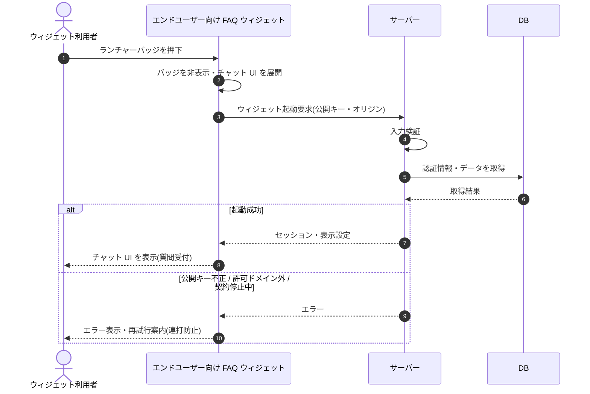

# SEQ-087: ランチャーバッジを押下

> **このページは、業務ユースケース UC-041（ランチャーバッジを押下）のシーケンス図を定義します。**

## 項目

| 項目 | 内容 |
|---|---|
| SEQ ID | `SEQ-087` |
| トレーサビリティID | [TR-041](../00_traceability/index.md#TR-041) |
| 画面イベント (EVT) | EVT-221 |
| 関連画面 | [SCR-030](../01_frontend/01_screens/SCR-030.md#SCR-030) |
| 関連 API | [API-037](../02_backend/03_apis/API-037.md#API-037) |
| 関連テーブル | — |
| エラー (ERR) | [ERR-006](../05_errors/ERR-006.md#ERR-006) ・ [ERR-028](../05_errors/ERR-028.md#ERR-028) ・ [ERR-029](../05_errors/ERR-029.md#ERR-029) |
| メッセージ (MSG) | — |

## 概要

ウィジェット利用者がランチャーバッジを押下すると、バッジを非表示にしてチャット UI を展開する。サーバーは公開キーとドメインを検証してウィジェットセッションを確立し、表示設定（タイトル・連絡先メール等）を返して質問受付状態にする。

## シーケンス図

## 例外フロー

- 公開キーが不正な場合、ウィジェットは起動せずエラーを表示する。
- リクエスト元オリジンが許可ドメイン外の場合、起動を拒否する。
- 契約が停止中の場合、起動を拒否しエラーを表示する。

## 備考

- 本図は基本設計レベルの抽象度(ユーザー / 画面 / サーバー、システム起点は外部システム・スケジューラ・バッチを加える)で記述する。DB 操作は DB アクターへのメッセージで表し、テーブル別 CRUD は本図に書かず 関連テーブル 欄で示す。
- 図の出典は業務ユースケース [UC-041](../../01_requirements/04_business_usecases/UC-041.md#UC-041)。画面イベントとの対応は UC-041 を参照。
