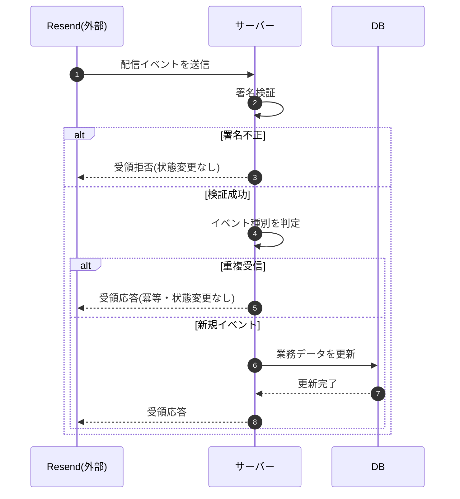

# SEQ-088: Resend Webhook 受信(配信状態更新)

> **このページは、業務ユースケース UC-058（Resend Webhook 受信(配信状態更新)）のシーケンス図を定義します。**

| ID | 業務ユースケースID | イベント(画面ID EVT-NN) | テーブルID |
|----|----|----|----|
| SEQ-088 | [UC-058](../../01_requirements/04_business_usecases/UC-058.md#UC-058) | — | [TBL-007](../02_backend/04_database/TBL-007.md#TBL-007) ・ [TBL-026](../02_backend/04_database/TBL-026.md#TBL-026) ・ [TBL-027](../02_backend/04_database/TBL-027.md#TBL-027) |

## 概要

メール配信事業者 Resend から受信した配信イベント Webhook を署名検証し、配信状態を更新する。バウンス / 苦情の宛先は抑制リストへ登録して以降の配信を停止し、署名不正は状態を変更せず、重複受信は冪等に扱う。

## シーケンス図

## 例外フロー

- **署名検証失敗**: 受領を拒否し、配信状態・抑制リストを変更しない([ERR-031](../05_errors/ERR-031.md#ERR-031))。
- **重複受信**: 同一イベントの再受信は冪等に扱い、配信状態・抑制リストを変更せず受領応答を返す([ERR-032](../05_errors/ERR-032.md#ERR-032))。

## 備考

- 本図は基本設計レベルの抽象度(ユーザー / 画面 / サーバー、システム起点は外部システム・スケジューラ・バッチを加える)で記述する。DB 操作は DB アクターへのメッセージで表し、テーブル別 CRUD は本図に書かず 関連テーブル 欄で示す。
- 図の出典は業務ユースケース [UC-058](../../01_requirements/04_business_usecases/UC-058.md#UC-058)。画面イベントとの対応は UC-058 を参照。
