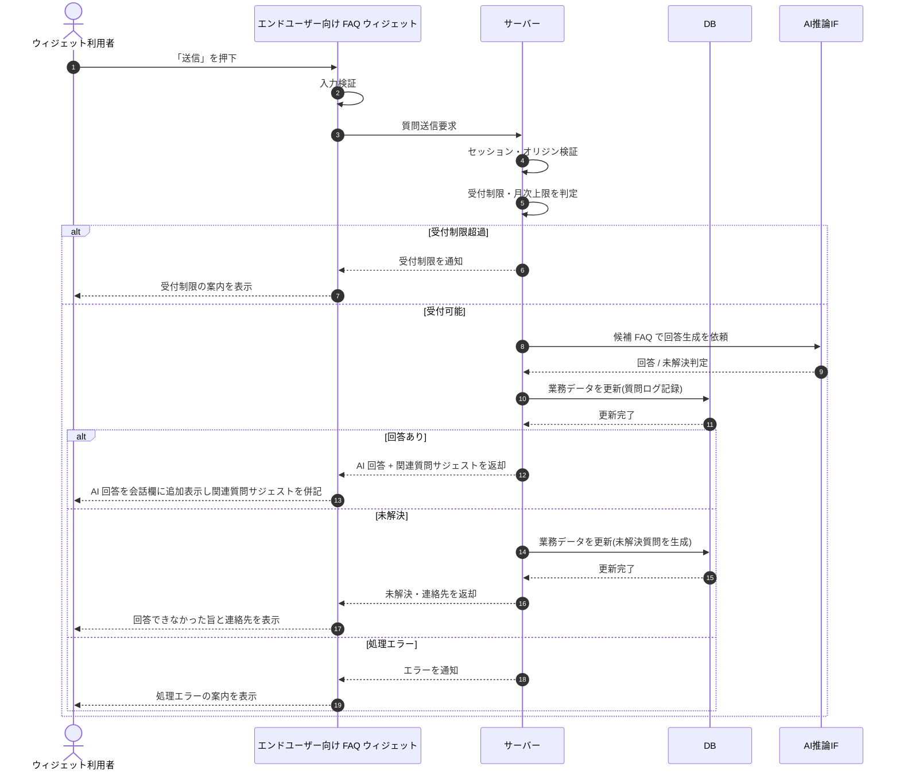

# SEQ-088: 「送信」を押下

> **このページは、業務ユースケース UC-042（「送信」を押下）のシーケンス図を定義します。**

## 項目

| 項目 | 内容 |
|---|---|
| SEQ ID | `SEQ-088` |
| トレーサビリティID | [TR-042](../00_traceability/index.md#TR-042) |
| 画面イベント (EVT) | SCR-030 EVT-04 |
| 関連画面 | [SCR-030](../01_frontend/01_screens/SCR-030.md#SCR-030) |
| 関連 API | [API-038](../02_backend/03_apis/API-038.md#API-038) |
| 関連テーブル | [TBL-017](../02_backend/04_database/TBL-017.md#TBL-017) |
| エラー (ERR) | [ERR-009](../05_errors/ERR-009.md#ERR-009) ・ [ERR-027](../05_errors/ERR-027.md#ERR-027) |
| メッセージ (MSG) | — |

## 概要

ウィジェット利用者が入力した質問を送信し、サーバーが AI 推論で回答を生成して質問ログを記録する。応答種別に応じて、回答を会話欄に追加表示するか、未解決・受付制限・処理エラーの各案内へ続く。

## シーケンス図

## 例外フロー

- 受付制限超過時はサーバーが受付制限を通知し、ウィジェットは案内を表示して送信を抑止する。
- 許可ドメイン外からの送信はサーバーがオリジン検証で拒否し、ウィジェットは処理エラーの案内を表示する。
- AI 推論やデータ更新が失敗した場合は処理エラーを通知し、ウィジェットは質問入力を継続可能なまま案内を表示する。

## 詳細設計への移管候補

| 内容 | 移管先候補 | 理由 |
|---|---|---|
| 質問ログと未解決質問を同一トランザクションで作成する整合性制御 | 詳細設計 / DB 設計 | 基本設計の抽象度では同時生成の業務結果のみ示す |
| `questionLogId` を基準とした冪等性担保 | 詳細設計 | 再送制御の実装詳細であり相互作用の流れに含めない |

## 備考

- 本図は基本設計レベルの抽象度（ユーザー / 画面 / サーバー、システム起点は外部システム・スケジューラ・バッチを加える）で記述する。DB 操作は DB アクターへのメッセージで表し、テーブル別 CRUD は本図に書かず 関連テーブル 欄で示す。
- 図の出典は業務ユースケース [UC-042](../../01_requirements/04_business_usecases/UC-042.md#UC-042)。画面イベントとの対応は UC-042 を参照。
