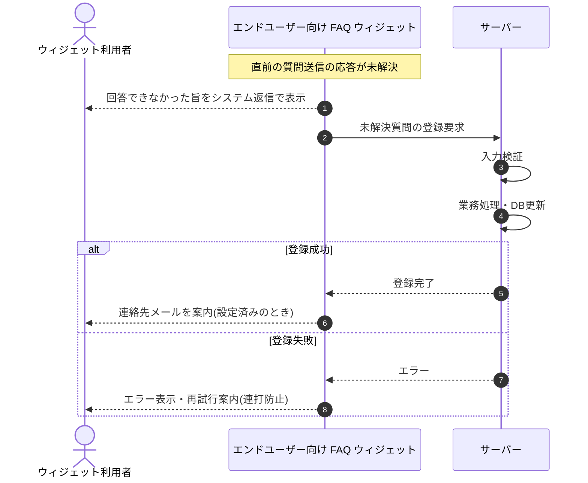

<!-- portal-top -->
[設計ポータル](../../README.md) ／ [基本設計](../index.md) ／ [シーケンス設計](index.md) ／ **SEQ-089: AI 回答(未解決)を受信**
<!-- /portal-top -->

# SEQ-089: AI 回答(未解決)を受信

> **このページは、業務ユースケース UC-044（AI 回答(未解決)を受信）のシーケンス図を定義します。**

*版数 v2.0 ・ 更新 2026-06-23 ・ ステータス ドラフト*

## 項目

| 項目 | 内容 |
|---|---|
| SEQ ID | `SEQ-089` |
| 対応業務ユースケース | [UC-044](../../01_requirements/04_business_usecases/UC-044.md#UC-044) |
| 業務要件 (BR) | 要確認 |
| 機能要件 (FR) | [FR-068](../../01_requirements/02_FunctionalRequirement/02_faq-ai-fr.md#FR-068) ・ [FR-058](../../01_requirements/02_FunctionalRequirement/02_faq-ai-fr.md#FR-058) ・ [FR-059](../../01_requirements/02_FunctionalRequirement/02_faq-ai-fr.md#FR-059) ・ [FR-065](../../01_requirements/02_FunctionalRequirement/02_faq-ai-fr.md#FR-065) ・ [FR-066](../../01_requirements/02_FunctionalRequirement/02_faq-ai-fr.md#FR-066) ・ [FR-067](../../01_requirements/02_FunctionalRequirement/02_faq-ai-fr.md#FR-067) |
| 画面イベント (EVT) | [EVT-227](../01_frontend/02_screen_events/EVT-227.md#EVT-227) |
| 関連画面 | [SCR-030](../01_frontend/01_screens/SCR-030.md#SCR-030) |
| 関連 API | [API-039](../02_backend/03_apis/API-039.md#API-039) |
| 関連テーブル | [TBL-017](../02_backend/04_database/TBL-017.md#TBL-017) |
| エラー (ERR) | — |
| メッセージ (MSG) | 要確認 |

## 概要

質問送信の応答が未解決のとき、回答できなかった旨をシステム返信として表示し、質問ログと未解決質問を登録する。連絡先メール設定済みのときは連絡先メールを案内表示し、別の質問の入力・送信は引き続き可能とする。

## シーケンス図

## 例外フロー

- 未解決質問の登録に失敗した場合は、ウィジェットにエラーを表示し再試行を案内する(連打防止)。

## 備考

- 本図は基本設計レベルの抽象度(ユーザー / 画面 / サーバー、システム起点は外部システム・スケジューラ・バッチを加える)で記述する。DB 操作はサーバー自己メッセージで表し、テーブル別 CRUD は本図に書かず 関連テーブル 欄で示す。
- 図の出典は業務ユースケース [UC-044](../../01_requirements/04_business_usecases/UC-044.md#UC-044)。画面イベントとの対応は UC-044 を参照。

---

<!-- portal-bottom -->
[← シーケンス設計](index.md) ・ [基本設計](../index.md) ・ [↑ 設計ポータル](../../README.md)
<!-- /portal-bottom -->
