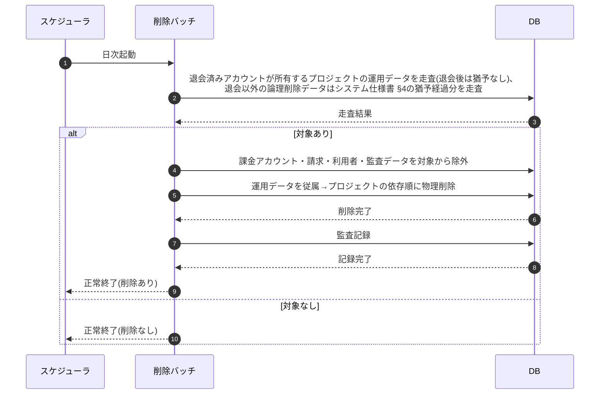

# SEQ-089: 退会済み・論理削除データの物理削除バッチ

> **このページは、業務ユースケース UC-066（退会済み・論理削除データの物理削除バッチ）のシーケンス図を定義します。**

| ID | 業務ユースケースID | イベント(画面ID EVT-NN) | テーブルID |
|----|----|----|----|
| SEQ-089 | [UC-066](../../01_requirements/04_business_usecases/UC-066.md#UC-066) | — | [TBL-001](../02_backend/04_database/TBL-001.md#TBL-001) ・ [TBL-002](../02_backend/04_database/TBL-002.md#TBL-002) ・ [TBL-003](../02_backend/04_database/TBL-003.md#TBL-003) ・ [TBL-004](../02_backend/04_database/TBL-004.md#TBL-004) ・ [TBL-005](../02_backend/04_database/TBL-005.md#TBL-005) ・ [TBL-006](../02_backend/04_database/TBL-006.md#TBL-006) ・ [TBL-008](../02_backend/04_database/TBL-008.md#TBL-008) ・ [TBL-009](../02_backend/04_database/TBL-009.md#TBL-009) ・ [TBL-013](../02_backend/04_database/TBL-013.md#TBL-013) ・ [TBL-014](../02_backend/04_database/TBL-014.md#TBL-014) ・ [TBL-015](../02_backend/04_database/TBL-015.md#TBL-015) ・ [TBL-017](../02_backend/04_database/TBL-017.md#TBL-017) ・ [TBL-018](../02_backend/04_database/TBL-018.md#TBL-018) ・ [TBL-019](../02_backend/04_database/TBL-019.md#TBL-019) ・ [TBL-020](../02_backend/04_database/TBL-020.md#TBL-020) ・ [TBL-021](../02_backend/04_database/TBL-021.md#TBL-021) ・ [TBL-022](../02_backend/04_database/TBL-022.md#TBL-022) ・ [TBL-023](../02_backend/04_database/TBL-023.md#TBL-023) ・ [TBL-024](../02_backend/04_database/TBL-024.md#TBL-024) ・ [TBL-025](../02_backend/04_database/TBL-025.md#TBL-025) ・ [TBL-026](../02_backend/04_database/TBL-026.md#TBL-026) ・ [TBL-027](../02_backend/04_database/TBL-027.md#TBL-027) ・ [TBL-028](../02_backend/04_database/TBL-028.md#TBL-028) ・ [TBL-029](../02_backend/04_database/TBL-029.md#TBL-029) ・ [TBL-031](../02_backend/04_database/TBL-031.md#TBL-031) ・ [TBL-032](../02_backend/04_database/TBL-032.md#TBL-032) |

## 概要

退会済み(`withdrawn`)アカウントが所有するプロジェクトの運用データ(FAQ・プロジェクト・質問ログ・未解決質問・利用量・通知・お知らせ等)を、退会後は猶予なく速やかに日次で物理削除し、あわせて退会以外の事由で論理削除(`valid=0`)された行を [システム仕様書 §4](../07_system-spec.md#4-データ保持期間削除猶予) の猶予期間経過後に物理削除する日次バッチである。削除は従属データから先に依存関係の順序で行い、削除内容を監査記録として残す。課金アカウント・請求・利用者・監査データは削除対象外とし、保持期間経過後の物理削除は [SYS-034](../02_backend/01_system/SYS-034.md#SYS-034) が担う。

## シーケンス図

## 例外フロー

- 削除対象(退会済みアカウントが所有するプロジェクトの運用データ、または [システム仕様書 §4](../07_system-spec.md#4-データ保持期間削除猶予) の猶予期間を経過した論理削除データ)が無い場合は削除を行わず正常終了する。
- いずれかの対象で削除が失敗した場合は当該対象の削除を中止し、整合性を損なわない範囲で処理を継続する。失敗は監査ログに記録し、次回バッチで再評価する。

## 詳細設計への移管候補

| 内容 | 移管先候補 | 理由 |
|---|---|---|
| 参照制約・依存関係を踏まえた具体の削除順序 | 詳細設計 | 基本設計では従属→プロジェクトの方向のみ示し、テーブル別の削除手順は詳細設計で確定するため |
| 監査ログ等の保持義務データの除外判定 | 詳細設計 | 削除対象外の条件判定ロジックは詳細設計の範囲のため |

## 備考

- 本図は基本設計レベルの抽象度(ユーザー / 画面 / サーバー、システム起点は外部システム・スケジューラ・バッチを加える)で記述する。DB 操作は DB アクターへのメッセージで表し、テーブル別 CRUD は本図に書かず 関連テーブル 欄で示す。
- 図の出典は業務ユースケース [UC-066](../../01_requirements/04_business_usecases/UC-066.md#UC-066)。画面イベントとの対応は UC-066 を参照。
