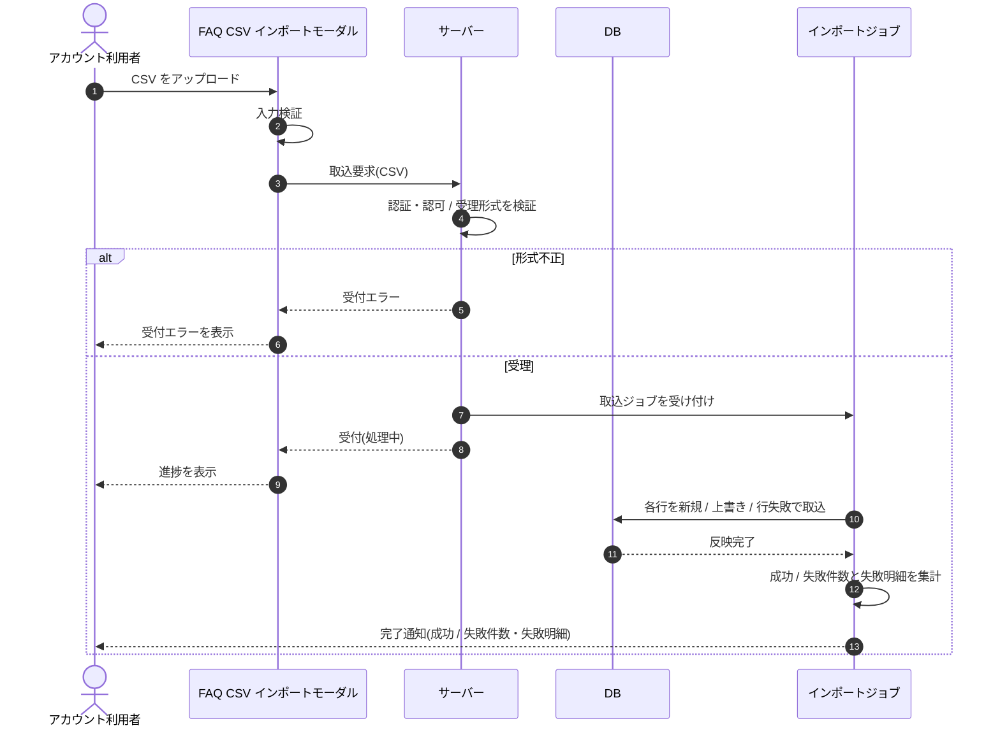

# SEQ-090: 非同期 CSV インポートジョブ

> **このページは、業務ユースケース UC-050（非同期 CSV インポートジョブ）のシーケンス図を定義します。**

## 項目

| 項目 | 内容 |
|---|---|
| SEQ ID | `SEQ-090` |
| トレーサビリティID | [TR-050](../00_traceability/index.md#TR-050) |
| 画面イベント (EVT) | — |
| 関連画面 | [SCR-010](../01_frontend/01_screens/SCR-010.md#SCR-010) |
| 関連 API | [API-028](../02_backend/03_apis/API-028.md#API-028) |
| 関連テーブル | [TBL-006](../02_backend/04_database/TBL-006.md#TBL-006) |
| エラー (ERR) | [ERR-024](../05_errors/ERR-024.md#ERR-024) ・ [ERR-025](../05_errors/ERR-025.md#ERR-025) |
| メッセージ (MSG) | — |

## 概要

アカウント利用者が FAQ CSV をアップロードすると、サーバーは受理形式を検証して取込ジョブを受け付け、画面応答をブロックせず非同期で行単位に取り込む。全行処理後に成功 / 失敗件数と失敗明細を集計し、完了を通知する。

## シーケンス図

## 例外フロー

- **受付前の形式不正**(CSV 以外 / 文字コード不正 / ヘッダ行欠落 / 件数上限超過): サーバーが受付前に拒否し（[ERR-024](../05_errors/ERR-024.md#ERR-024)）、ジョブは起動しない。画面は受付エラーを表示する。
- **行単位エラー**（当該プロジェクトに存在しない FAQ ID など、[ERR-025](../05_errors/ERR-025.md#ERR-025)): 当該行のみを失敗扱いとし、成功分は反映する。1 行の失敗は他行の取り込みに影響しない。失敗明細は完了通知で確認できる。

## 詳細設計への移管候補

| 内容 | 移管先候補 | 理由 |
|---|---|---|
| CSV の行単位ループ(新規 / 上書き / 行失敗の判定と反映) | 詳細設計 | 基本設計では「各行を取込」に抽象化し、行ごとの分岐・反映手順は詳細設計で定義する |
| 部分失敗時の成功分確定(各行の成否独立) | 詳細設計 | トランザクション境界・行単位確定の方式は実装方針に依存する |

## 備考

- 本図は基本設計レベルの抽象度(ユーザー / 画面 / サーバー、システム起点は外部システム・スケジューラ・バッチを加える)で記述する。DB 操作は DB アクターへのメッセージで表し、テーブル別 CRUD は本図に書かず 関連テーブル 欄で示す。
- 図の出典は業務ユースケース [UC-050](../../01_requirements/04_business_usecases/UC-050.md#UC-050)。画面イベントとの対応は UC-050 を参照。
