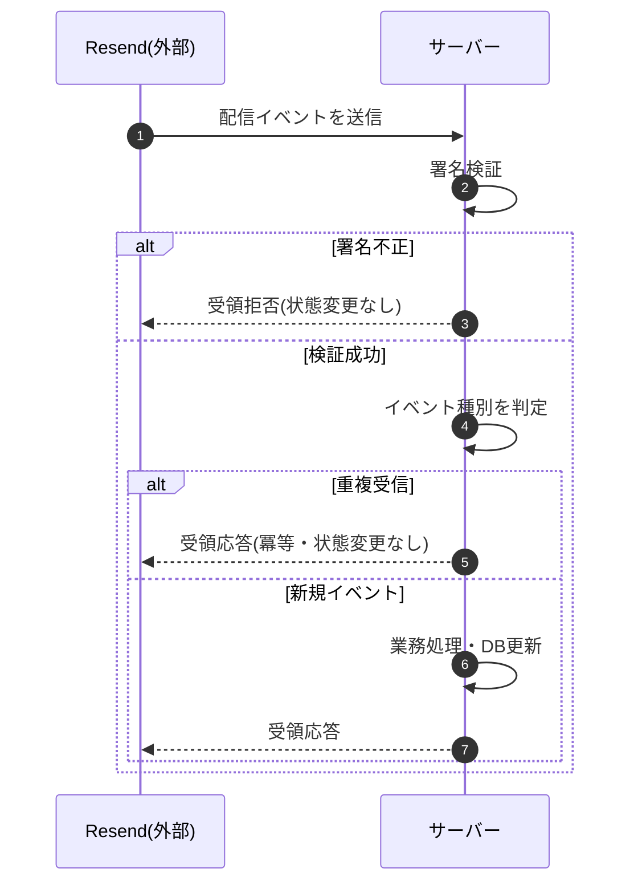

# SEQ-091: Resend Webhook 受信(配信状態更新)

> **このページは、業務ユースケース UC-063（Resend Webhook 受信(配信状態更新)）のシーケンス図を定義します。**

## 項目

| 項目 | 内容 |
|---|---|
| SEQ ID | `SEQ-091` |
| 対応業務ユースケース | [UC-063](../../01_requirements/04_business_usecases/UC-063.md#UC-063) |
| 業務要件 (BR) | [BR-082](../../01_requirements/01_business_requirement/05_notification-br.md#BR-082) ・ [BR-084](../../01_requirements/01_business_requirement/05_notification-br.md#BR-084) |
| 機能要件 (FR) | [FR-115](../../01_requirements/02_functional_requirement/05_notification-fr.md#FR-115) ・ [FR-124](../../01_requirements/02_functional_requirement/05_notification-fr.md#FR-124) |
| 画面イベント (EVT) | — |
| 関連画面 | — |
| 関連 API | [API-059](../02_backend/03_apis/API-059.md#API-059) |
| 関連テーブル | [TBL-007](../02_backend/04_database/TBL-007.md#TBL-007) ・ [TBL-026](../02_backend/04_database/TBL-026.md#TBL-026) ・ [TBL-027](../02_backend/04_database/TBL-027.md#TBL-027) |
| エラー (ERR) | [ERR-034](../05_errors/ERR-034.md#ERR-034) ・ [ERR-035](../05_errors/ERR-035.md#ERR-035) |
| メッセージ (MSG) | — |

## 概要

メール配信事業者 Resend から受信した配信イベント Webhook を署名検証し、配信状態を更新する。バウンス / 苦情の宛先は抑制リストへ登録して以降の配信を停止し、署名不正は状態を変更せず、重複受信は冪等に扱う。

## シーケンス図

## 例外フロー

- **署名検証失敗**: 受領を拒否し、配信状態・抑制リストを変更しない([ERR-034](../05_errors/ERR-034.md#ERR-034))。
- **重複受信**: 同一イベントの再受信は冪等に扱い、配信状態・抑制リストを変更せず受領応答を返す([ERR-035](../05_errors/ERR-035.md#ERR-035))。

## 備考

- 本図は基本設計レベルの抽象度(ユーザー / 画面 / サーバー、システム起点は外部システム・スケジューラ・バッチを加える)で記述する。DB 操作はサーバー自己メッセージで表し、テーブル別 CRUD は本図に書かず 関連テーブル 欄で示す。
- 図の出典は業務ユースケース [UC-063](../../01_requirements/04_business_usecases/UC-063.md#UC-063)。画面イベントとの対応は UC-063 を参照。
