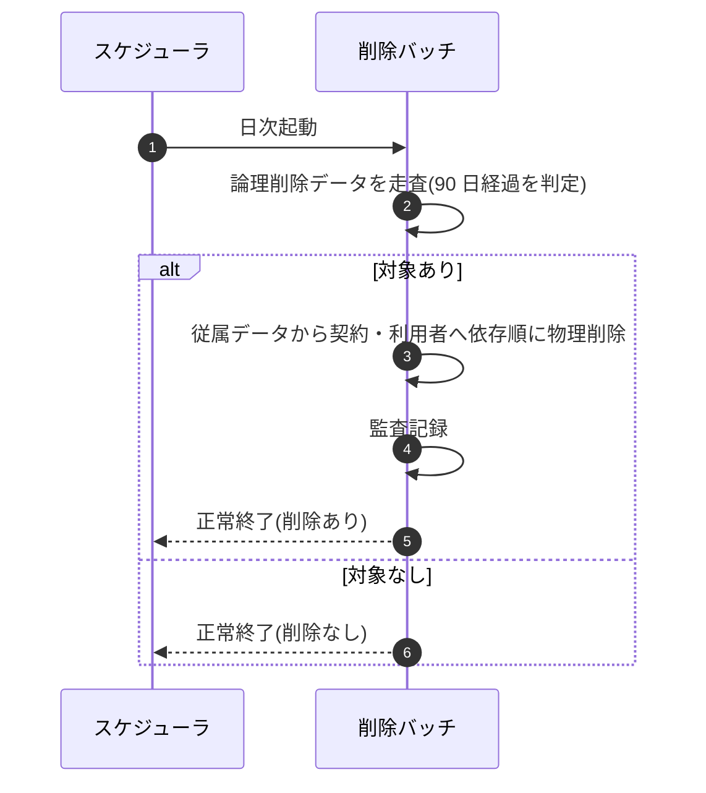

<!-- portal-top -->
[設計ポータル](../../README.md) ／ [基本設計](../index.md) ／ [シーケンス設計](index.md) ／ **SEQ-092: 90 日物理削除バッチ**
<!-- /portal-top -->

# SEQ-092: 90 日物理削除バッチ

> **このページは、業務ユースケース UC-071（90 日物理削除バッチ）のシーケンス図を定義します。**

*版数 v2.0 ・ 更新 2026-06-23 ・ ステータス ドラフト*

## 項目

| 項目 | 内容 |
|---|---|
| SEQ ID | `SEQ-092` |
| 対応業務ユースケース | [UC-071](../../01_requirements/04_business_usecases/UC-071.md#UC-071) |
| 業務要件 (BR) | 要確認 |
| 機能要件 (FR) | [FR-138](../../01_requirements/02_FunctionalRequirement/06_security-fr.md#FR-138) |
| 画面イベント (EVT) | — |
| 関連画面 | — |
| 関連 API | — |
| 関連テーブル | [TBL-001](../02_backend/04_database/TBL-001.md#TBL-001) ・ [TBL-002](../02_backend/04_database/TBL-002.md#TBL-002) ・ [TBL-027](../02_backend/04_database/TBL-027.md#TBL-027) |
| エラー (ERR) | — |
| メッセージ (MSG) | 要確認 |

## 概要

退会等で論理削除されたデータのうち、論理削除日から 90 日を経過したものを依存関係の順序に従って物理削除する日次バッチである。削除内容を監査ログに記録し、保持義務のあるデータは削除対象外として残す。

## シーケンス図

## 例外フロー

- 90 日経過データが無い場合は削除を行わず正常終了する。
- いずれかの対象で削除が失敗した場合は当該対象の削除を中止し、整合性を損なわない範囲で処理を継続する。失敗は監査ログに記録し、次回バッチで再評価する。

## 詳細設計への移管候補

| 内容 | 移管先候補 | 理由 |
|---|---|---|
| 参照制約・依存関係を踏まえた具体の削除順序 | 詳細設計 | 基本設計では従属→契約・利用者の方向のみ示し、テーブル別の削除手順は詳細設計で確定するため |
| 監査ログ等の保持義務データの除外判定 | 詳細設計 | 削除対象外の条件判定ロジックは詳細設計の範囲のため |

## 備考

- 本図は基本設計レベルの抽象度(ユーザー / 画面 / サーバー、システム起点は外部システム・スケジューラ・バッチを加える)で記述する。DB 操作はサーバー自己メッセージで表し、テーブル別 CRUD は本図に書かず 関連テーブル 欄で示す。
- 図の出典は業務ユースケース [UC-071](../../01_requirements/04_business_usecases/UC-071.md#UC-071)。画面イベントとの対応は UC-071 を参照。

---

<!-- portal-bottom -->
[← シーケンス設計](index.md) ・ [基本設計](../index.md) ・ [↑ 設計ポータル](../../README.md)
<!-- /portal-bottom -->
