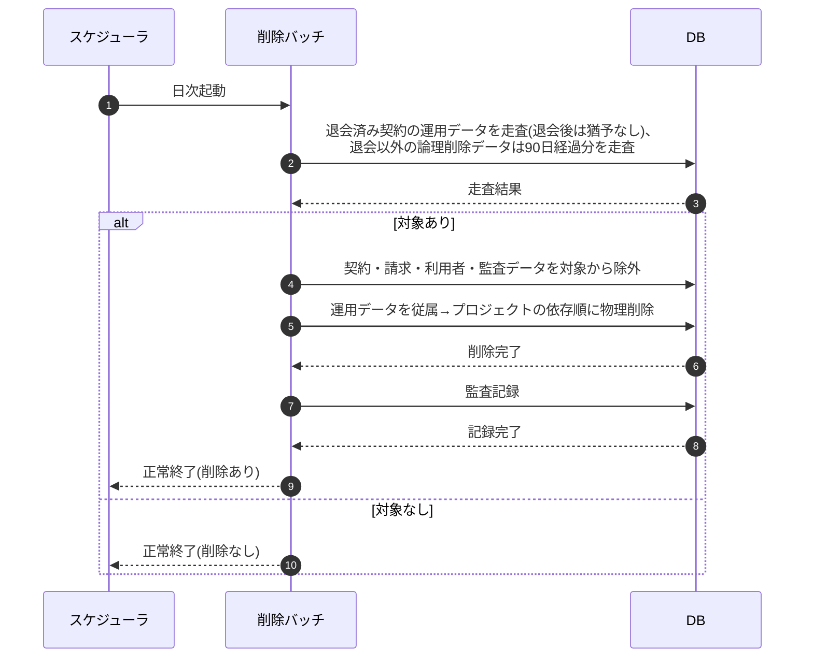

# SEQ-092: 退会済み・論理削除データの物理削除バッチ

> **このページは、業務ユースケース UC-070（退会済み・論理削除データの物理削除バッチ）のシーケンス図を定義します。**

## 項目

| 項目 | 内容 |
|---|---|
| SEQ ID | `SEQ-092` |
| トレーサビリティID | [TR-070](../00_traceability/index.md#TR-070) |
| 画面イベント (EVT) | — |
| 関連画面 | — |
| 関連 API | — |
| 関連テーブル | [TBL-002](../02_backend/04_database/TBL-002.md#TBL-002)(退会済み走査の起点・本処理では削除しない)・退会済み契約の運用データ各表(プロジェクト・FAQ・質問ログ・未解決質問・利用量・お知らせ・通知ログ等)・[TBL-027](../02_backend/04_database/TBL-027.md#TBL-027)(監査記録)。対象テーブルの網羅は [SYS-029](../02_backend/01_system/SYS-029.md#SYS-029) §5 入出力一覧 / [TR-070](../00_traceability/index.md#TR-070) のデータベース列を正本とする(契約 `M_CONTRACT`・利用者 `M_USER` は対象外) |
| エラー (ERR) | — |
| メッセージ (MSG) | — |

## 概要

退会済み(`withdrawn`)契約に属する運用データ(FAQ・プロジェクト・質問ログ・未解決質問・利用量・通知・お知らせ等)を、退会後は猶予なく速やかに日次で物理削除し、あわせて退会以外の事由で論理削除(`valid=0`)された行を猶予期間(90 日)を経過した時点で物理削除する日次バッチである。削除は従属データから先に依存関係の順序で行い、削除内容を監査記録として残す。契約・請求・利用者・監査データは削除対象外とし、保持期間(7 年)にわたり別途保持する(7 年経過後の物理削除は [SYS-036](../02_backend/01_system/SYS-036.md#SYS-036) が担う)。

## シーケンス図

## 例外フロー

- 削除対象(退会済み契約の運用データ、または 90 日経過した論理削除データ)が無い場合は削除を行わず正常終了する。
- いずれかの対象で削除が失敗した場合は当該対象の削除を中止し、整合性を損なわない範囲で処理を継続する。失敗は監査ログに記録し、次回バッチで再評価する。

## 詳細設計への移管候補

| 内容 | 移管先候補 | 理由 |
|---|---|---|
| 参照制約・依存関係を踏まえた具体の削除順序 | 詳細設計 | 基本設計では従属→プロジェクトの方向のみ示し、テーブル別の削除手順は詳細設計で確定するため |
| 監査ログ等の保持義務データの除外判定 | 詳細設計 | 削除対象外の条件判定ロジックは詳細設計の範囲のため |

## 備考

- 本図は基本設計レベルの抽象度(ユーザー / 画面 / サーバー、システム起点は外部システム・スケジューラ・バッチを加える)で記述する。DB 操作は DB アクターへのメッセージで表し、テーブル別 CRUD は本図に書かず 関連テーブル 欄で示す。
- 図の出典は業務ユースケース [UC-070](../../01_requirements/04_business_usecases/UC-070.md#UC-070)。画面イベントとの対応は UC-070 を参照。
