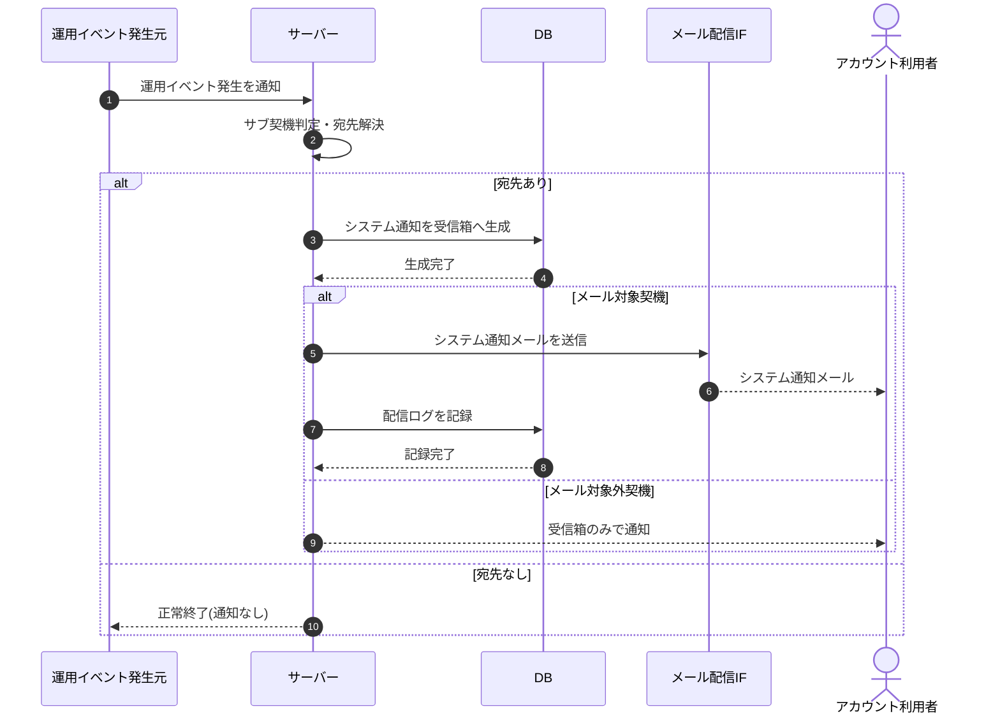

# SEQ-093: 運用イベントのシステム通知自動生成

> **このページは、業務ユースケース UC-060（運用イベントのシステム通知自動生成）のシーケンス図を定義します。**

| ID | シーケンス名 |
|----|----|
| SEQ-093 | 運用イベントのシステム通知自動生成 |

| 関連項目 | 内容 |
|----|----| 
| 業務ユースケース | [UC-060](../../01_requirements/04_business_usecases/UC-060.md#UC-060) |
| イベント | — |
| 関連画面 | — |
| 関連API | [API-048](../02_backend/03_apis/API-048.md#API-048) / [API-058](../02_backend/03_apis/API-058.md#API-058) |
| テーブル | [TBL-022](../02_backend/04_database/TBL-022.md#TBL-022) / [TBL-026](../02_backend/04_database/TBL-026.md#TBL-026) |
| エラー(ERR) | — |
| メッセージ(MSG) | [MSG-013](../06_messages/MSG-013.md#MSG-013) |

## 概要

運用イベント(利用上限接近・AI 利用上限到達・通知失敗急増・サスペンション・復元・規約改定・価格改定 等)の発生を契機に、対象アカウント利用者の受信箱へ「システム通知」のお知らせを自動生成し、メール対象の契機ではシステム通知メールも送信して配信ログを記録する。

## シーケンス図

## 例外フロー

- **宛先なし**: 対象アカウント利用者が解決できない場合は通知を生成せず、正常終了する。
- **メール配信失敗**: 受信箱お知らせは生成済みとし、メール送信失敗は配信ログに失敗として記録する(再送は通知再送ユースケースが扱う)。

## 備考

- 本図は基本設計レベルの抽象度(ユーザー / 画面 / サーバー、システム起点は外部システム・スケジューラ・バッチを加える)で記述する。DB 操作は DB アクターへのメッセージで表し、テーブル別 CRUD は本図に書かず 関連テーブル 欄で示す。
- 図の出典は業務ユースケース [UC-060](../../01_requirements/04_business_usecases/UC-060.md#UC-060)。画面イベントとの対応は UC-060 を参照。
