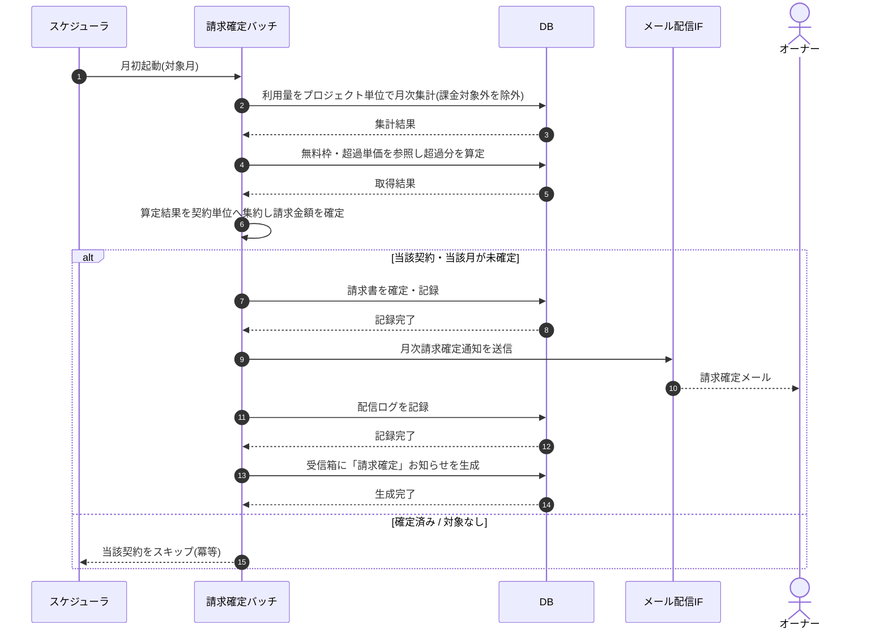

# SEQ-093: 月次請求確定バッチ

> **このページは、業務ユースケース UC-059（月次請求確定バッチ）のシーケンス図を定義します。**

## 項目

| 項目 | 内容 |
|---|---|
| SEQ ID | `SEQ-093` |
| 対応業務ユースケース | [UC-059](../../01_requirements/04_business_usecases/UC-059.md#UC-059) |
| 業務要件 (BR) | [BR-059](../../01_requirements/01_business_requirement/03_usage-br.md#BR-059) ・ [BR-077](../../01_requirements/01_business_requirement/05_notification-br.md#BR-077) ・ [BR-111](../../01_requirements/01_business_requirement/05_notification-br.md#BR-111) |
| 機能要件 (FR) | [FR-087](../../01_requirements/02_functional_requirement/03_usage-fr.md#FR-087) ・ [FR-121](../../01_requirements/02_functional_requirement/05_notification-fr.md#FR-121) |
| 画面イベント (EVT) | — |
| 関連画面 | — |
| 関連 API | [API-043](../02_backend/03_apis/API-043.md#API-043) ・ [API-058](../02_backend/03_apis/API-058.md#API-058) |
| 関連テーブル | [TBL-002](../02_backend/04_database/TBL-002.md#TBL-002) ・ [TBL-009](../02_backend/04_database/TBL-009.md#TBL-009) ・ [TBL-019](../02_backend/04_database/TBL-019.md#TBL-019) ・ [TBL-020](../02_backend/04_database/TBL-020.md#TBL-020) ・ [TBL-022](../02_backend/04_database/TBL-022.md#TBL-022) ・ [TBL-026](../02_backend/04_database/TBL-026.md#TBL-026) |
| エラー (ERR) | — |
| メッセージ (MSG) | [MSG-007](../06_messages/MSG-007.md#MSG-007) |

## 概要

月次境界経過後に、プロジェクト単位で計測した利用量を契約単位へ集約して請求書を確定し、オーナーへ確定通知メールと受信箱お知らせを生成する月次バッチである。確定済みの契約は冪等にスキップし、同一契約・同一月の二重請求を防ぐ。

## シーケンス図

## 例外フロー

- **対象なし**: 対象月に請求対象の利用が無い契約は請求書を生成せず、当該契約をスキップして処理を継続する。
- **二重確定**: 当該契約・当該月の請求書が既に確定済みの場合は確定・通知を行わず、冪等に当該契約をスキップする。
- **通知配信失敗**: 請求書は確定済みとし、確定通知の配信失敗は配信ログに失敗として記録する。再送は別途の通知再送ユースケースが扱う。

## 詳細設計への移管候補

| 内容 | 移管先候補 | 理由 |
|---|---|---|
| 契約単位の処理ループ・対象走査 | 詳細設計 | 基本設計では契約 1 件の流れに抽象化しており、対象集合の反復は実装詳細のため。 |
| 二重確定防止の冪等性キー | 詳細設計 | 同一契約・同一月の一意制約とキー設計は実装レベルの詳細のため。 |

## 備考

- 本図は基本設計レベルの抽象度(ユーザー / 画面 / サーバー、システム起点は外部システム・スケジューラ・バッチを加える)で記述する。DB 操作は DB アクターへのメッセージで表し、テーブル別 CRUD は本図に書かず 関連テーブル 欄で示す。
- 図の出典は業務ユースケース [UC-059](../../01_requirements/04_business_usecases/UC-059.md#UC-059)。画面イベントとの対応は UC-059 を参照。
